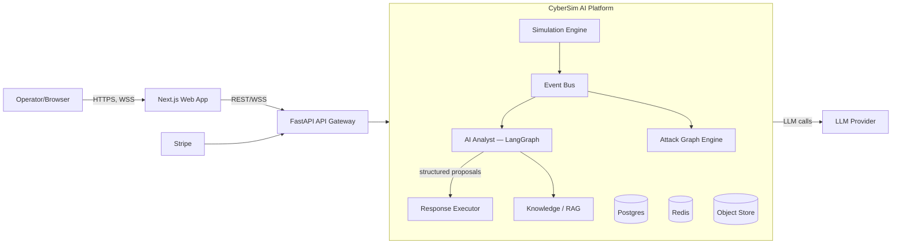
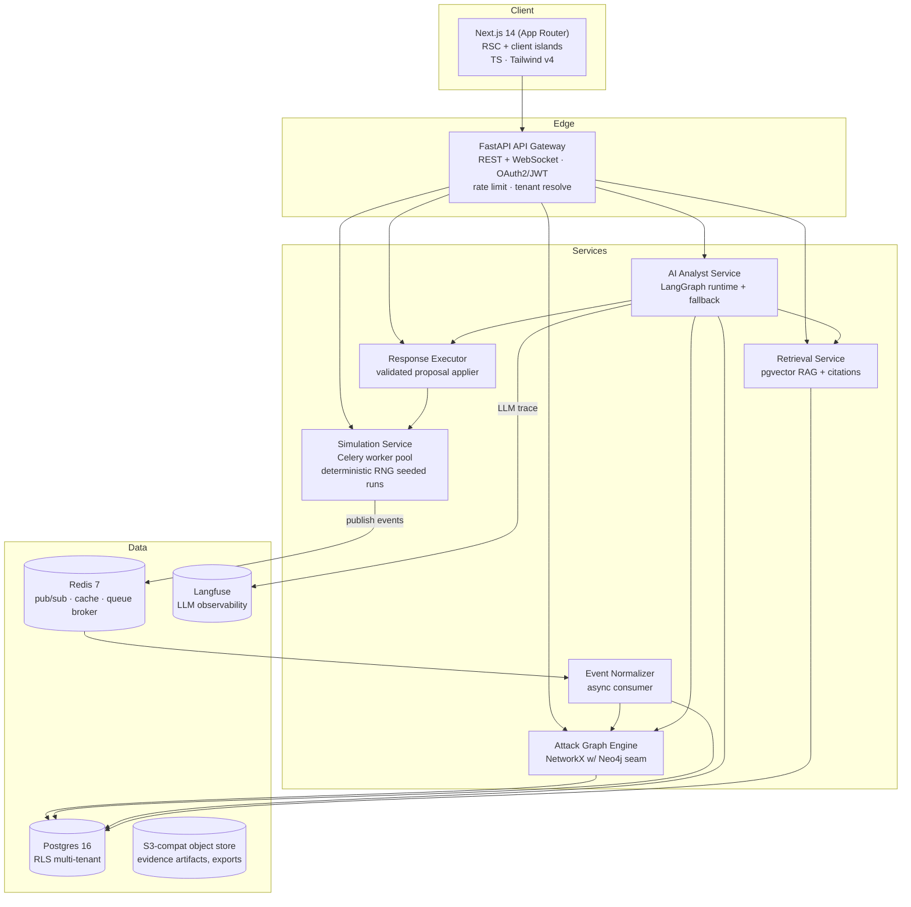
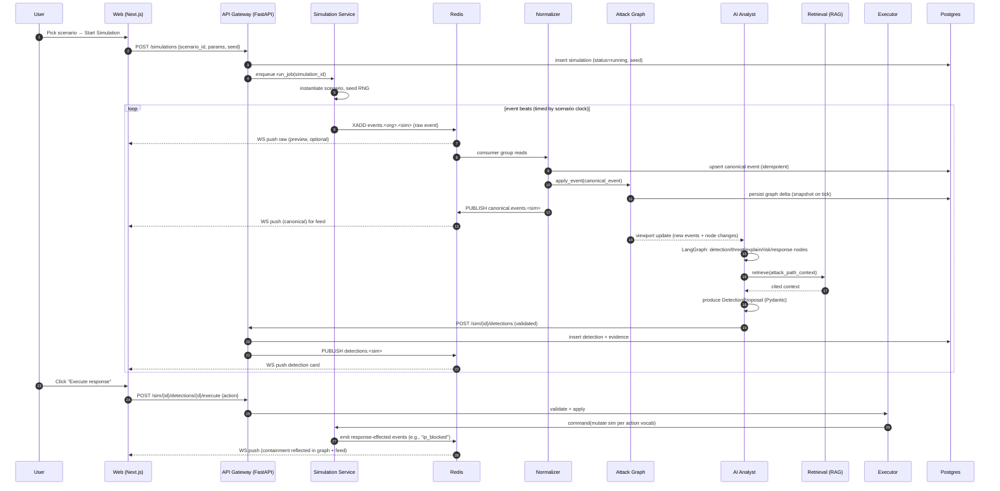

# 03 — System Architecture

This document defines the runtime architecture of CyberSim AI: the components, their boundaries, data flows, deployment topology, and the critical request sequences. It is the map referenced by every other module; cross-docs must not contradict it.

---

## 1. Architectural principles

1. **Producer/consumer first.** Simulators produce events; the analyst consumes them. They share **only** the canonical event contract (`07`) and the event bus. No simulator may import analyst code and vice versa.
2. **Deterministic core, stochastic periphery.** All security-relevant decisions (severity, response execution) are made by deterministic code; the LLM only **proposes**. Trust flows from determinism (vision brief: "The LLM should not directly control the simulation").
3. **Reproducibility is a feature.** Any simulation `S` with seed `σ` must reproduce the same event stream. AI invocations are stored with inputs so analyst decisions can be re-derived. Tests depend on this.
4. **Multi-tenant from line one.** Every component carries `org_id`. There is no "tenantify later" pass; retrofitting is far costlier than building it in. See `15`.
5. **Real-time push, not poll.** Live UX uses WebSockets with Redis pub/sub fan-out. The API still exposes REST for everything non-realtime (mirrors OpenAI's hybrid of REST + streaming).
6. **Honest degradation.** LLM failure → rule-based fallback detector with lowered confidence and a visible "AI degraded" banner. Never fake AI output (`01` §3).
7. **Stateless API, stateful services.** The FastAPI layer is stateless and horizontally scalable; state lives in Postgres, Redis, the graph store, and the object store.

## 2. C4 — System context (Level 1)



External integrations: **LLM provider** (e.g., OpenAI/Anthropic via LiteLLM-style adapter), **Stripe** (billing), **email** (transactional), **object storage** (S3-compatible), **Langfuse** (LLM observability). All others are internal.

## 3. C4 — Container diagram (Level 2)



### Container responsibilities

| Container | Responsibility | Stateless? | Horiz. scale | Notes |
|-----------|---------------|------------|--------------|-------|
| `web` (Next.js) | UI, SSR initial paint, route auth gates, streaming UI for chat | mostly (RSC) | yes | Edge runtime for auth routes; Node runtime for SSR. |
| `api` (FastAPI gateway) | AuthN/Z, request validation, tenant resolution, rate limit, REST + WS fan-in | yes | yes | Owns no business logic; orchestrates services via internal calls or broker topics. |
| `simulation-service` | Instantiates a scenario, runs deterministic event generation, responds to *Execute Response* commands that mutate the simulation state | worker (per-run) | via worker pool | Seeded RNG; emits events to `events.<org_id>.<simulation_id>` Redis stream. |
| `event-normalizer` | Consumes raw sim events, validates, canonicalizes, persists, republishes to `canonical.events` | stateless consumer | yes | **The** source of truth for normalized events. Idempotent (dedup by event id). |
| `attack-graph-engine` | Manages per-simulation attack graph; updates on events; answers path queries | stateful per simulation | bounded by hot graphs + LRU | Backed by NetworkX with a documented Neo4j migration seam (`10`). |
| `ai-analyst-service` | LangGraph runtime; ingests canonical events; emits validated Detection proposals | stateless (state in graph) | yes | Fallback rule-based detector when LLM unavailable. |
| `response-executor` | Validates a Detection's recommended_actions and applies them to the simulation; logs audit trail | stateless | yes | Never trusts the LLM; whitelisted action vocabulary (`14`). |
| `retrieval-service` | RAG: embed query, vector search in pgvector, rerank, return cited context | stateless | yes | Tenant-scoped + global knowledge partitions (`12`). |

## 4. Data flow — canonical happy path (Journey A)



### Why producer/consumer with a normalizer between?

> **Self-question:** Why not have simulators emit already-canonical events and skip the normalizer? **Answer:** (1) Simulators are user-extensible in v0.2; a strict canonical boundary protects the analyst from simulator drift. (2) The normalizer is the dedup/identity seam (idempotency on event id). (3) It's where enrichment (GeoIP-ish stubs, MITRE tagging, asset resolution) happens *once*, keeping simulator modules simple. (4) It allows replay: raw→canonical is recomputable, so a parser bug is non-destructive (we keep raw). Cost is one hop of latency (Kafka/Redis stream) and an extra worker; worth it for the safety properties above.

## 5. Logical component view (sub-domain)

```
cybersim/
├── api/               # FastAPI gateway (auth, REST, WS, rate limit)
├── simulation/        # scenario catalog + deterministic sim core + 4 simulators
│   ├── core/          # clock, RNG seeding, beat scheduler, scenario DSL
│   ├── web/  api/  network/  supplychain/
│   └── catalog/       # scenarios/*.yaml mounted at startup
├── events/            # canonical schema (pydantic), normalizer, bus adapters
├── graph/             # attack graph engine (NetworkX + Neo4j seam), traversal queries
├── analyst/           # LangGraph nodes/state/prompts, fallback detector, guardrails
├── knowledge/         # ingestion (MITRE/OWASP/CVE), embeddings, retrieval, citations
├── response/          # executor, action vocabulary, audit log
├── platform/          # tenants, users, auth, billing, usage metering, entitlements
├── realtime/          # WS hub, Redis pub/sub adapters
└── infra/             # config, logging, tracing, health, migrations
apps/web/             # Next.js frontend
```

> Path conventions are normative (`21`).

## 6. ADR-style: key boundary decisions

### 6.1 Why a single FastAPI gateway vs. service mesh?
MVP runs one FastAPI process group behind a load balancer with internal Python packages for each sub-domain. We **do not** introduce a full service mesh now. Rationale: operational simplicity dominates at MVP scale (10s–100s of tenants, 100s of simulations/day). When the analyst service's LLM latency profile diverges (slow I/O), we split it out as an independently scalable process *behind the same gateway*, not a separate mesh.

> **Rejected:** microservices from day 1 — premature network/observability cost; a single well-modularized monolith (with bounded via packages + queue seams) gives 90% of the decoupling. **Rejected:** "everything in one FastAPI handler" — tight coupling breaks the determinism/real-time boundary and makes testing harder. **Decision:** modular monolith + a real message bus (Redis streams) for the producer/consumer seam.

### 6.2 Why Redis Streams for the event bus?
Simulators emit events at steady beat rates (10–100/s per simulation) with bursts. Required guarantees: ordered per-simulation, at-least-once, replayable, consumer groups, multi-consumer fan-out for the dashboard WS hub. Redis Streams give all of this in one managed surface area.

> **Rejected:** Kafka — overkill for MVP cardinality; ops cost disproportionate. **Rejected:** Postgres LISTEN/NOTIFY — no consumer groups, no stream offset persistence; fine for tiny loads but breaks at burst + multi-consumer. **Migration seam:** the bus is abstracted behind `EventBus` interface; Kafka can be a drop-in for an environment where scale demands it (`04`).

### 6.3 Why separate `event-normalizer` from `simulation-service`?
The normalizer is the contract enforcer. Simulator engines (Python-in-process) sit *with* the worker; the normalizer is a *consumer* in the orchestration language. Two processes (or at least two consumer groups) is what makes the contract real and lets us pause/flush independently during incidents. (See §4 rationale.)

### 6.4 Why store graph in NetworkX, not Neo4j from day one?
NetworkX is dependency-light, in-process, trivially testable, fast for graphs up to ~10^4 nodes, fits every MVP scenario (per-simulation graphs are small: ≤100 nodes). Neo4j shines at large, shared, persistently-queried graphs — not our MVP shape (graphs are ephemeral-per-sim).

> **Migration seam:** all graph access goes through `graph.repo.GraphRepository` (abstract). NetworkX is the v0.1 impl, Neo4j is the v0.2 impl. The seam keeps the eviction of NetworkX to one package. (`05`, `10`.)

## 7. Deployment topology (logical) — composed via Docker Compose dev; prod in `17`

```
┌─────────────────────────┐   ┌─────────────────────────┐
│ CDN + edge cache        │   │ Stripe webhooks (TLS)   │
│ (static + SSR edge)     │   │ → /v1/billing/* (no TLS)│
└──────────┬──────────────┘   └──────────┬──────────────┘
           ↓ HTTPS                         ↓ HTTPS
   ┌───────────────┐                ┌──────────────────────┐
   │ Next.js (web) │←──auth──→      │ FastAPI api gateway  │
   │ Node runtime  │                │ (stateless, ×N)      │
   └───────────────┘                └────────┬──────┬──────┘
                                            ↓      ↓
                ┌───────────────────────────┘      └─────────────────────────┐
                ↓                                                ↓
        ┌──────────────────┐                          ┌───────────────────────────┐
        │ Simulation workers       │                  │ AI analyst service        │
        │ (Celery ×pool)             │                  │ (LangGraph, ×pool)         │
        └──┬───────────────┘                          └────────┬──────────────────┘
            │                                                     │
            └──► Redis Pub/Sub + Streams ──┬──► Normalizer ──► Attack Graph ──► Postgres
                                          └──► WS hub fan-out ──► web
   Object store (S3) ← exports/evidence artifacts    Langfuse ← LLM trace
```

### Horizontal scalability profile (v0.1 targets)
| Tier | Scales by | Bottleneck | Mitigation |
|------|-----------|------------|------------|
| API gateway | concurrent request count | LLM-mediated endpoints | Concurrency limits + queue-ingestion for analyst; WS fan-out via Redis |
| Normalizer | event rate | Postgres upsert throughput | Batching upserts (50/s batched), partial indexes by sim_id |
| AI analyst | LLM call latency | provider rate limits | Token bucket + LLM concurrency cap; fallback detector + de-dup detection windows |
| Simulation workers | max concurrent sims | worker process count | Celery autoscaling bounded by plan entitlements |
| Graph engine | hot graphs | memory | LRU evict cold graphs; rehydrate from snapshot |
| WS hub | connections per instance | per-process memory | sticky sessions OR Redis fan-out (choosing **Redis fan-out**, see `08`) |

## 8. Major sequences (referenced throughout)

### 8.1 Detection → response execution (critical path, with validation)

```mermaid
sequenceDiagram
  participant A as Analyst (LangGraph)
  participant G as Graph
  participant E as Evidence Validator
  participant V as Retrieval
  participant Dto as Detection DTO (Pydantic)
  participant API
  participant Exec as Executor
  participant Sim
  participant DB

  A->>G: get_attack_path(node_ids, time_window)
  G-->>A: path + nodes + edges
  A->>V: retrieve_context(threat_class, mitre_tags)
  V-->>A: cited_context (≥1 citation)
  A->>A: LLM call (structured JSON → Pydantic)
  A->>Dto: DetectionProposal.validate()
  Dto-->>A: ok|raise (evidence_missing etc.)
  alt validated
    A->>API: submit_detection()
    API->>DB: insert with FKs to events + graph nodes
  else invalid
    A->>A: log rejection reason; emit Telemetry event; if recoverable, retry with stricter prompt
  end
  Note over API,Exec: On user "Execute response":
  API->>Exec: execute(detection_id, action_id)
  Exec->>Exec: whitelist-check(action); scope-check(org/sim)
  Exec->>Sim: command(action) within simulation sandbox
  Sim->>DB: append audit log
  Sim-->>Exec: ack + side-effect events
  Exec->>DB: insert executed_action row
```

### 8.2 Real-time fan-out for the SOC dashboard

- (1) Web opens `wss://api/ws` carrying JWT claim `org_id`.
- (2) WS hub subscribes to Redis `PUBLISH` channels for **that org** only: `canonical.events.<sim>`, `detections.<sim>`, `graph.delta.<sim>`, `actions.<sim>`.
- (3) On publish, hub fans the message to all WS clients whose subscription is authorized for that simulation.
- (4) Backpressure: client advertises a max rate; hub coalesces to ≤4 frames/sec/subscription; excess placed in a per-client buffer (drop-oldest beyond 100).

> **Self-question:** Sticky sessions vs. Redis fan-out — sticky sessions are simpler. **Answer:** Sticky sessions break under rolling deploys and load balancer failover; a multi-instance WS hub backed by Redis pub/sub is the industry-standard scalable approach and decouples WS server identity from data. One extra component; pays off the moment we deploy more than one API instance. (Production choices in `17`.)

## 9. Failure model & degradation

| Failure | Behavior | User-visible |
|---------|----------|--------------|
| LLM provider down / 5xx | Analyst service falls back to **rule-based detector** with `confidence ≤ 0.6`; detections tagged `source="rules"`. Telemetry alert. | Banner: "AI tier degraded — heuristic analysis active." Detections visibly lower-confidence. |
| LLM partial/invalid JSON | Retry once with stricter prompt; on second failure, run rule-based; do not surface partial. | Possibly a brief "still analyzing…" state. |
| Normalizer lag spike | Dashboard shows event buffers; WS hub sends a "lag" frame; user can choose to pause feed. | "Catch-up indicator: N events behind." |
| Attack graph OOM | Evict cold graphs; rehydrate from PG snapshot; affected simulations surface "graph paused" for ≤2s. | Brief graph pause; no data loss. |
| Postgres primary down | API returns 503 with retry-after; web shows degraded shell (cached feed tail); writes blocked, reads stale-tail. | Honest outage screen; no silent corruption. |
| Redis bus down | Simulations block emit (bounded buffer); running simulations show "events queued." Telemetry alert. | A clear, narrow failure surface. |

## 10. Security boundary overview (full detail in `15`)
- All ingress behind TLS; WAF on edge.
- JWT (short-lived access + refresh) issued by the gateway. WS connects with a one-time WS ticket (≤60s TTL) derived from the refresh flow.
- Tenant resolution: `org_id` from verified JWT; never trusted from body/query. RLS scopes Postgres.
- LLM provider secrets in a secret manager; the FastAPI process loads at boot, never serialized to DB/logs.
- Simulations are sandboxed: containerized worker, no egress, dropped capabilities, read-only root FS, seccomp profile (`15`).

## 11. Cross-doc impact map
- This doc's components/maps must match `04` (stack), `08` (API), `09` (DB), `10` (graph), `11` (analyst), `13` (frontend), `17` (deploy). If you change a boundary here, update those and bump a version header in each affected doc.

---

End of `03-system-architecture.md`. Next: `04-tech-stack-decisions.md`.
