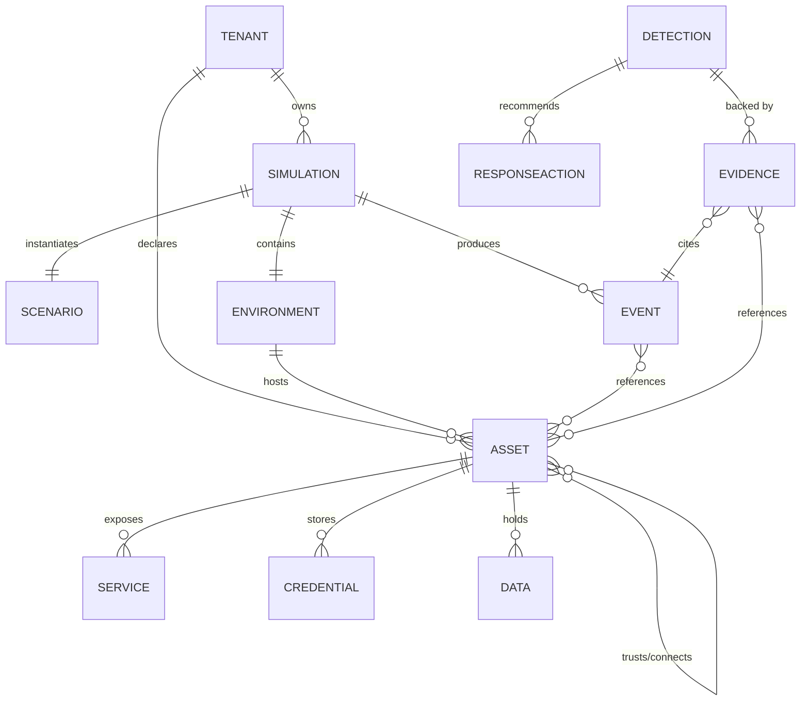

# 05 — Domain Model & Attack Graph

This document specifies the **core domain** of CyberSim AI: the entities, the **attack graph** (the heart of the product), attack-chain semantics, the threat taxonomy, the MITRE ATT&CK mapping, and a worked example per simulator. Every other doc that references "attack graph," "attack chain," "asset," "foothold," or "MITRE technique" defers to definitions here.

---

## 1. Why a graph (and not an alert feed)

> *"Your AI isn't just looking at isolated alerts. It can reason: 'these five events are probably part of the same attack chain.'"* — product brief.

An alert feed is a flat list: every correlation is implicit and lives in the analyst's head (or an LLM's prompt). The attack graph makes correlations **explicit and machine-queryable**: a credential used in attack A turns into a node both attack A and an emerging attack B can traverse. The graph is what lets the analyst say "lateral movement" with evidence (the edge from the compromised host to the DB exists and was used), not vibes.

Concretely we get three things:
1. **Path queries** ("can the attacker reach User Data from internet?") drive detection reasoning.
2. **Node identity** lets us join evidence: the same compromised credential appears across otherwise-unrelated events.
3. **Time-indexed deltas** let us replay intrusion progression for explanations and replays.

## 2. Top-level domain entities



### 2.1 Entity definitions (normative)

| Entity | Identity | Description | Where stored |
|--------|----------|-------------|--------------|
| **Tenant (Org)** | `org_id` | Customer workspace. Owns everything below. | Postgres `orgs` (`09`) |
| **Scenario** | `scenario_id` (slug) | Declarative spec of an environment + adversary behavior. Bundled YAML in `simulation/catalog/` and (v0.2) user-uploaded. | Postgres + filesystem catalog |
| **Simulation** | `simulation_id` (UUIDv7) | A single seeded run of a scenario; has clock, RNG, status. | Postgres `simulations` |
| **Environment** | derived per simulation | The asset topology for this run (a snapshot of the scenario's env, possibly modified by responses). | Graph store + Postgres `graph_snapshots` |
| **Asset** | `asset_id` (per simulation) | A host/container/identity/service instance. Has type, attributes, exposure. | Graph node + Postgres `assets` |
| **Service** | `service_id` | A network-exposed capability on an asset (e.g., `/api/login`, `:5432/postgres`). | Graph node (a Service node) + Postgres |
| **Credential** | `cred_id` | A reusable identity secret (user/pass, token, key). Has validity, scope, exposure. | Graph node + Postgres |
| **Data** | `data_id` | A logical store of sensitive records (e.g., `users`, `payments`). | Graph node + Postgres |
| **Edge** | typed | Trust/connect/access/dependency relations between nodes. | Graph edges + Postgres `graph_edges` |
| **Event** | `event_id` (UUIDv7) | A canonical record of one thing that happened (`07`). | Postgres `events` |
| **Detection** | `detection_id` | Analyst output: threat+severity+confidence+evidence+response plan (`11`). | Postgres `detections` |
| **Evidence** | composite | One piece of evidence: cites ≥1 events + ≥1 graph refs, with label. | Postgres `detection_evidence` |
| **Response Action** | `action_id` | A unit of recommended/possible response (`14`). | Postgres `response_actions`, `executed_actions` |

## 3. The attack graph (core)

### 3.1 Node taxonomy (NodeTypes)

```
AssetType: gateway | load_balancer | web_server | api_server | database
           | auth_service | identity_provider | worker | cache
           | workstation | bastion | dependency | package_registry | package | user_account
NodeKind:  ASSET | SERVICE | CREDENTIAL | DATA | NETWORK_ZONE | EDGE_DEVICE   (Asset nodes exist next to abstract nodes)
```
Each node carries a normalized **attributes map** (`JSONB`) for type-specific fields (e.g., a `package` node has `name`, `version`, `registry`; a `service` node has `protocol`, `port`, `endpoint`, `authz`).

### 3.2 Edge taxonomy (EdgeTypes)

| Edge | Direction | Meaning | Annotated with |
|------|-----------|---------|----------------|
| `CONNECTS_TO` | Asset→Service/Asset | Network reachability (L3/L4 path exists) | `proto`, `port`, `network` |
| `EXPOSES` | Asset→Service | Asset exposes this service (port/endpoint) | `endpoint`, `protocol` |
| `RUNS` | Asset→Service | Service runs on the asset | — |
| `AUTHENTICATES_WITH` | Service/Account→Credential | Can authenticate using this credential | `strength`, `mfa:bool` |
| `STORES` | Asset→Credential / Asset→Data | This asset persistently holds the credential/data | — |
| `TRUSTS` | Asset→Asset | Trusts identity/certs of the target (e.g., shared SSO, mutual TLS) | `scope` |
| `DEPENDS_ON` | Asset→Dependency/Package | Software dependency relationship | `version_range`, `constraint` |
| `FETCHES_FROM` | Asset→Package_REGISTRY | Pulls packages from registry | — |
| `LATERAL_TO` | Asset→Asset | Credentials could allow lateral flow | `cred_id`, `method` |
| `READS`/`WRITES` | Service→Data | The service reads/writes data | `priv` |
| `IMPACTS` | Asset→Data | Successful access could impact data | `kind` (exfil/integrity/avail) |

### 3.3 Attacker-side annotations (overlay graph)

The graph above is the **environment graph** (blueprint of what *exists*). On top of it we maintain an **attacker overlay**: per-asset **foothold state**, plus per-edge **attacker-traversed** edges. This separation matters:
- The environment graph is re-built from the scenario on simulation init; **responses can mutate** it (block IP, isolate host, rotate credential).
- The overlay is **append-only** during detection reasoning and records the inferred attacker path; **it cannot be mutated by responses directly** — responses mutate the environment graph and the overlay recomputes.

**Asset foothold states:**
| State | Meaning |
|-------|---------|
| `clean` | No attacker presence |
| `recon` | Attacker has performed reconnaissance (open) |
| `attempted` | Attacker has tried an exploit against it |
| `foothold` | Attacker has established foothold (code/exec/credential) |
| `compromised` | Attacker controls it |
| `contained` | Was compromised; response has contained (limits blast radius) |
| `quarantined` | Removed from reachable graph |

**Overlay edges (attacker transitions):**
| Edge | Meaning |
|------|---------|
| `OBSERVED` | Attacker recon target (recon) |
| `EXPLOITED` | Successful exploit (attempted→foothold) |
| `CREDS_EXTRACTED` | Credentials taken from a foothold |
| `TRAVERSED` | Used a credential/access to move to a new node (lateral) |
| `EXFILTRATED` | Data extraction achieved |
| `PRIV_ESCALATED` | Local/role privilege escalation |

#### 3.3.1 Why split environment vs. overlay?
> **Self-question:** Could we collapse these into one labeled graph? **Answer:** We refused because it conflates *what is* with *what the attacker did*, which destroys our ability to (a) cleanly apply responses to the environment without losing the inferred attack path, (b) replay only the attacker overlay without replaying environment mutations, and (c) report "evidence: the attacker used edge X" without ambiguity. Splitting costs one extra `kind` column and a few overlays; it pays for itself the first time a response lands mid-chain.

### 3.4 Graph lifecycle

1. **Init:** `Scenario.environment` → instantiate environment graph; overlay empty; all footholds `clean`.
2. **Per event:** the normalizer/calibrator applies events to **both** the overlay (attacker-side annotations) and possibly the environment (responses mutate environment). Each event references `target_node_id` and optional `via_edge_id`.
3. **Snapshot ticking:** every `Δt` (default 2s sim-time, configurable), persist a *delta* (changed nodes/edges). Full snapshot on schedule (every 30s) for cheap rehydration.
4. **Queries:** path queries (`can_reach(src, dst)`, `attack_paths_within(depth=K)`) run against a *view* that combines environment (allowed) and overlay (attacker-known usable). This is the analyst's view.
5. **Response execution:** `executor` mutates environment graph (e.g., `REMOVE edge CONNECTS_TO` between attacker's source IP zone and the web service). Overlay recomputes reachable set; new events reflect the containment.

### 3.5 A worked environment graph (Web App scenario)

```mermaid
graph LR
  INET((Internet)) --> LB[Load Balancer]
  LB EXPOSES-->|https/443| WEB[Web Server]
  LB EXPOSES-->|https/443| API[API Server]
  WEB RUNS-->|/login| LOGINSvc[Login endpoint]
  API RUNS-->|/api/*| APISvc[API endpoints]
  WEB AUTHENTICATES_WITH-->|session cookie| AUTH[Auth Service]
  API AUTHENTICATES_WITH-->|JWT| AUTH
  AUTH STORES-->|hashed creds| UCREDS[(user creds)]
  WEB READS-->|SQL| DB[(Database)]
  AUTH READS-->|SQL| DB
  DB STORES-->|rows| UD[(User Data)]
  AUTH DEPENDS_ON-->|lib-jwt 1.2.3| PKGJWT[package: lib-jwt]
```

### 3.6 The matching attack chain (overlay) for SQLi via `/login`

```mermaid
graph LR
  SRC((Attacker<br/>203.0.113.42)) OBSERVED-->|port 443| LB
  LB EXPLOITED-->|SQLi /login| LOGINSvc
  LOGINSvc CREDS_EXTRACTED-->|hash dump| UCREDS
  UCREDS TRAVERSED-->|reused cred| AUTH
  AUTH TRAVERSED-->|auth session| API
  API EXFILTRATED-->|SELECT *| UD
```

This is exactly the chain the analyst surfaces as evidence (the brief's "credential compromise → privilege escalation → data access" story).

## 4. Threat taxonomy & MITRE ATT&CK mapping

### 4.1 Threat classes (canonical enum)

```python
class ThreatClass(str, Enum):
    SQL_INJECTION              = "sql_injection"
    XSS                        = "xss"
    PATH_TRAVERSAL             = "path_traversal"
    AUTH_BYPASS                = "auth_bypass"
    CREDENTIAL_BRUTE_FORCE     = "credential_brute_force"
    CREDENTIAL_COMPROMISE      = "credential_compromise"
    IDOR                       = "idor"
    EXCESSIVE_DATA_EXPOSURE    = "excessive_data_exposure"
    RATE_ABUSE                 = "rate_abuse"
    BROKEN_AUTH                = "broken_auth"
    PRIVESSCATION              = "privilege_escalation"
    LATERAL_MOVEMENT           = "lateral_movement"
    PORT_SCAN                  = "port_scan"
    SERVICE_DISCOVERY          = "service_discovery"
    SUPPLY_CHAIN               = "supply_chain"
    MALICIOUS_PACKAGE          = "malicious_package"
    DATA_EXFILTRATION          = "data_exfiltration"
    BENIGN                     = "benign"  # explicit "not a threat" label
```
> **Self-question:** Why an explicit `BENIGN` label? **Answer:** So that the analyst can actively attest "these events are not an attack," which is valuable evidence for "false-positive discipline" (`01` §7). Without it, the system can only fail to *report* detection — never *explain* non-malice.

### 4.2 MITRE ATT&CK (Enterprise) mapping

| Threat class (ours) | Tactic (TA) | Technique (T) | Sub-technique |
|---------------------|-------------|----------------|---------------|
| SQL_INJECTION | TA0001 Initial Access | T1190 Exploit Public-Facing Application | — |
| XSS | TA0001 | T1059.007 JavaScript Execution | Stored XSS sub-case |
| AUTH_BYPASS | TA0001 | T1190 | Auth bypass as exploit |
| CREDENTIAL_BRUTE_FORCE | TA0006 Credential Access | T1110 Brute Force | T1110.001–.004 variants |
| CREDENTIAL_COMPROMISE | TA0006 | T1078 Valid Accounts | (account used after compromise) |
| IDOR | TA0001 | T1190 | Forced browsing |
| LATERAL_MOVEMENT | TA0008 Lateral Movement | T1021 Remote Services | T1021.x variants per protocol |
| PRIVILEGE_ESCALATION | TA0004 Privilege Escalation | T1068 / T1078.011 | Exploitation / Group Policy |
| PORT_SCAN / SERVICE_DISCOVERY | TA0007 Discovery | T1046 / T1046 | Network Service Discovery |
| SUPPLY_CHAIN / MALICIOUS_PACKAGE | TA0001 | T1195 Supply Chain Compromise | T1195.002 Compromise SW Supply Chain / T1195.003 Compromise HW |
| DATA_EXFILTRATION | TA0010 Exfiltration | T1041 Exfiltration Over C2 / T1567 Exfil Over Web Service | per-channel |

The mapping is **normative and the source of MITRE training data for RAG (`12`)** and MITRE tag display on DetectionCards (`02` §4.4). Repo path `cybersim.graph.mitre.Mapping`.

### 4.3 OWASP Top 10 (2021) cross-reference (secondary, for remediation)

| Threat | OWASP |
|--------|-------|
| SQL_INJECTION | A03:2021 Injection |
| XSS | A03:2021 Injection |
| AUTH_BYPASS / BROKEN_AUTH / CREDENTIAL_* | A07:2021 Identification & Auth Failures |
| IDOR | A01:2021 Broken Access Control |
| SUPPLY_CHAIN / MALICIOUS_PACKAGE | A08:2021 Software & Data Integrity Failures |
| EXCESSIVE_DATA_EXPOSURE | A01 + A04 (Insecure Design) |

## 5. Attack chain templates (canonical narratives)

A chain is **literally a path in the overlay graph** with stage annotations. Stages follow the brief's progressions:

```
Initial Access  →  (Web vulnerability | Network intrusion | Supply chain)  →
[Foothold]      →  Credential extraction (optional)                           →
Lateral movement (optional)   →   Privilege escalation (optional)            →
Database/service access       →   Data exfiltration / Impact
```

### 5.1 Chain templates (we instantiate on Normalizer applying overlay)

| Template | Chain (MITRE stages) | Used by |
|----------|---------------------|---------|
| **web_chain_sqli** | Initial Access (T1190) → Cred extraction (T1003-like file dump) → Lateral (T1021 DB) → Exfil (T1041) | Web App sim |
| **web_chain_xss** | Initial Access (T1059.007) → Steal session (T1552-like) → Valid account (T1078) → Exfil | Web App sim |
| **api_chain_idor** | Initial Access (T1190 IDOR) → Enumeration → Excessive data | API sim |
| **api_chain_brute** | Brute Force (T1110) → Valid account (T1078) → Privilege escalation (T1068) → Exfil | API/Network sim |
| **net_chain_recon-move** | Discovery (T1046) → Brute Force (T1110) → Lateral (T1021) → Exfil (T1041) | Network sim |
| **supply_chain_chain** | Supply Chain (T1195) → Code exec (T1059) → Lateral (T1021) → Impact (T1486-like / exfil) | Supply Chain sim |

### 5.2 Chain detection (overlay → DetectionCandidate)
When the Normalizer/Graph apply an event that **closes** an overlay path to a `Data` node with `kind=exfil/integrity/avail`, the graph engine emits a `ChainCompletedSignal`. The analyst consumes this with the event batch and reasons about which chain template (`11`) it matches — connecting back to RAG (MITRE technique docs).

## 6. Severity & confidence conventions

(These apply across graph/AI; expanded in `11`.)

### 6.1 Severity rubric (deterministic; the LLM proposes from this rubric but the validator enforces)
| Sev | Definition (impact × reachability) |
|-----|------------------------------------|
| info | Observability fact; no threat |
| low | Attack observed but unsuccessful OR no meaningful impact reachable; far from sensitive data in graph |
| medium | Active attempt with potential but **no foothold yet** OR foothold on non-sensitive asset |
| high | Foothold on a node within **K=2 hops** of sensitive Data; readable path exists |
| critical | Foothold AND actively exfiltrating/altering sensitive Data OR control over Identity Provider / `auth_service` |

> The graph distance to `Data` nodes is **the deterministic severity input.** The LLM proposes; the validator recomputes graph distance and **clamps** severity to ≥ relational severity if it under-claims. (Cross-doc `11`.)

### 6.2 Confidence
`0.0–1.0`. Computed by the analyst, but **bounded**:
- ≥0.75 requires ≥3 evidence items AND ≥1 graph traversal chain evidence AND ≥1 RAG-cited reference.
- [0.5, 0.75) requires ≥2 evidence + ≥1 graph evidence.
- <0.5 requires no minimum but lowers card emphasis (info-grey).
- The validator clamps over-confident claims when evidence is insufficient (a "humility guardrail," `11`).

## 7. Per-simulator worked scenario + graph (summary; full in `06`)

| Simulator | Default scenario | Graph uniqueness |
|-----------|------------------|------------------|
| Web App | `/api/login` SQLi → DB | Adds `Service` nodes per endpoint; `READS` edges to DB; SSO-style `AUTHENTICATES_WITH` |
| API | IDOR on `/api/orders/{id}` + brute force on `/api/auth` | Per-resource `Service` nodes; per-object `Data` scoping; rate counters as node attrs |
| Network | Bastion→internal lateral move | `NETWORK_ZONE` nodes; `CONNECTS_TO` L3 reachability is the dominant edge |
| Supply Chain | `lib-jwt` malicious package → app compromise | `DEPENDS_ON`/`FETCHES_FROM`/`Package` nodes; supply-chain story is the transitive dependency closure |

(Full simulator specs: each builds its env graph from a scenario env template — see `06`.)

## 8. Decision rationale & alternatives (domain)

| Decision | Chosen | Rejected | Why |
|----------|--------|----------|-----|
| Graph separation (env + overlay) | Split | One labeled graph | Replay & response mutate disjoint, plus unambiguous "attacker used edge X" evidence. |
| Foothold state enum | 7-state | Binary compromised flag | Lets evidence say "attempted but failed" (lookups, etc.) and "contained" vs "compromised". |
| Severity anchored on graph distance to Data | Yes | LLM-decides-only | Deterministic legibility; defends severity; "graph distance is hard evidence." |
| Explicit `BENIGN` threat class | Yes | "Absent detection" | Active false-positive discipline; turn the noise INTO evidence. |
| MITRE mapping as normative table | Yes | Ad-hoc per prompt | Lets RAG + tags be deterministic; "MITRE T1110" on a card is real, not invented. |
| Chain templates over free-form chains | Templates | None | Gives the analyst scaffolding to match; still allows novel chains via graph traversal when no template fits. |
| Attack graph per-project `GraphRepository` seam | Yes | Direct NetworkX calls everywhere | Lets v0.2 swap Neo4j; preserves the testability of the abstraction (`04`). |

---

End of `05-domain-model-attack-graph.md`. Next: `06-simulators-spec.md`.
