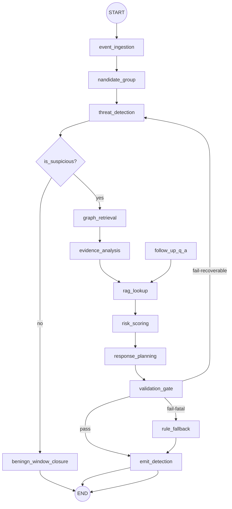

# 11 — AI Analyst (LangGraph)

The agent that ingests canonical events, reasons over the attack graph and RAG, and emits **evidence-grounded detection proposals** that the platform validates before surfacing. This is the analytic core that distinguishes CyberSim AI from a dashboard bolted onto an LLM.

> **Normative principles (recap from `01` §3, `03` §1):** the LLM **proposes**, deterministic code **validates and acts**. Evidence is mandatory. Structured outputs only. The LLM never mutates simulation state. Honest degradation to a rule-based fallback detector.

---

## 1. The state machine (LangGraph)



> Note `RAG` is invoked *after* `EVI` (graph-based evidence) so retrieval is grounded in the concrete attack path, not a generic query. Order matters: graph → evidence framing → RAG → risk → response → validate.

### 1.1 Why LangGraph (defended again here)
The analyst is literally a state machine with shared state, tools, conditional edges, checkpointing, and replay (`04` §2.3). Conditional edge `is_suspicious? yes/no` is one `add_conditional_edges` call. Checkpoints give us free run replay (`reproducibility is a feature`). Tools wrap `GraphRepository` queries + `KnowledgeRepository` retrieval. This is not "LangGraph because the name contains Graph" — the shape is a graph.

### 1.2 Checkpointing
We checkpoint at every node transition with key `simulation_id + window_seq` (the analyst runs on grouped event "windows", §3.1). Storage: Postgres table `analyst_checkpoints` mirroring Langfuse trace ids (or LangGraph `Memory` store via its Postgres checkpointer). Replaying a checkpoint gives byte-identical analyst state, modulo LLM nondeterminism (mitigated by temperature 0 + `seed`, see §7).

## 2. Analyst state schema

```python
# cybersim/analyst/state.py
class AnalystState(TypedDict):
    org_id: str
    simulation_id: str
    window_seq: int                       # monotonic window id; checkpoint key
    events: list[CanonicalEvent]          # events in this analysis window
    candidate_group: AnalysisCandidate | None
    attack_path: AttackPath | None
    evidence: list[Evidence]
    rag_context: list[CitedKnowledge]
    risk: RiskAssessment | None
    proposed_detection: DetectionProposal | None
    validation: ValidationResult
    telemetry: dict                       # counters, retries, llm_meta
    degraded: bool                        # true if running on fallback
```

`AnalysisCandidate` = the chosen event cluster; `RiskAssessment` = severity+confidence+attack path closure; `DetectionProposal` = Pydantic model emitted to validator.

## 3. Nodes — detailed

### 3.1 `event_ingestion` (deterministic, no LLM)
- Consumes canonical events off the bus for `sim_id`; accumulates a **window** until either (a) ≥ `WINDOW_SIZE` events (`default 24`), (b) `WINDOW_TIMEOUT_SEC` (`default 6s`) since first event in window, or (c) a **chain-closing** event arrives (an `evidence.data_exfil` overlay edge or an attack path closing). Windows are deterministic: windowing by **sequence** (max 24 / 6s = deterministic given the schedule).
- Output: a window of events becomes `state.events`.

### 3.2 `candidate_group` (deterministic, no LLM)
- **Group** events into "leads" by joining on `correlation_key` (same src_ip / token / cred_id / package) and `target_node_ids` overlap. Also produces a "global" candidate covering low-confidence loose anomalies.
- Also tags benign-only windows: if every event is `benign=true` and no severity_hint ≥ low, candidate = None (route to `NONE` closure).

### 3.3 `threat_detection` (LLM, structured output)
A triage call: given the candidate, **determine whether suspicious**, and if so a likely `threat_class`.
- **Tool use:** the analyst may invoke (only this node has graph & RAG tools enabled):
  - `get_attack_paths(node_kinds=["DATA"])` (via `GraphRepository`)
  - `get_neighbors(node_id)` (lighter-weight)
  - `retrieve_knowledge(query, kind)` (preview)
- **Output (Pydantic):**
```python
class DetectionTriage(BaseModel):
    is_suspicious: bool
    threat_class: ThreatClass | None                  # None if not suspicious
    rationale_one_line: str = Field(max_length=280)
    confidence_signal: Literal["low","medium","high"]
    suggested_attack_path_node_ids: list[str] = []
```
- Conditional edge: `is_suspicious=False and severity_hint all ≤ low` → `NONE` (window closes benign; emits **explicit Benign attestation** as an analyst `detection` with `threat_class=benign` — this is the FP-discipline artifact, `05` §4.1).
- If `False` but **severity hint ≥ medium** present: we DO go down the chain (cautious) — the LLM is overrulable by deterministic signal; this is the inverse of the validator that clamps the LLM's over-claims. We clamp both directions.

### 3.4 `graph_retrieval` (LLM-as-tool-orchestrator)
- The node calls `GraphRepository.attack_paths()` for the candidate nodes.
- Builds `state.attack_path` (top scoring path closing at `DATA`).
- If `state.attack_path` is None but `is_suspicious` was True, **lower confidence band** to `low` and add a `graph_traversal` evidence item with `kind:none` (we still need to surface we couldn't find a path).
- This is the only place the analyst can mutate analytical state in a way that affects validation.

### 3.5 `evidence_analysis` (LLM, structured output)
- Builds the **evidence list**. Direct deterministic evidence (`event_burst`, `behavioral_signature`) is computed by code first; the LLM picks + reweights + writes prose for human-facing labels.
- Constraint: **at least 3 evidence items** for `confidence ≥ 0.75`; at least 2 for `confidence ≥ 0.5` (`05` §6.2).
```python
class EvidenceItem(BaseModel):
    label: str = Field(max_length=64)        # "repeated_failed_logins"
    kind: Literal["event_burst","graph_traversal","credential_state","knowledge_citation","behavioral_signature"]
    weight: float = Field(ge=0, le=1)
    event_ids: list[str]                     # required for kinds != knowledge_citation
    graph_node_ids: list[str] = []
    citation_refs: list[str] = []            # knowledge entry ids (RAG)
    summary: str = Field(max_length=200)
```

### 3.6 `rag_lookup` (deterministic + LLM-query)
- Scaffold: the analyst's threat_class maps to expected MITRE techniques (deterministic map `05` §4.2). Build a hybrid query: top `k=8` vector + keyword hits filtered by `mte_*` tags expected.
- Rerank via cross-encoder (or fallback to BM25 score + cosine blend) for the top 8 → top 4 cited items.
- Each cited item becomes a `knowledge_citation` EvidenceItem (separate from vector; required for confidence ≥ 0.75).
- **Tools used:** `KnowledgeRepository.retrieve(query, k, filters)`.

### 3.7 `risk_scoring` (LLM, structured output; clamped)
```python
class RiskAssessment(BaseModel):
    severity: Severity
    confidence: float = Field(ge=0, le=1)
    rationale: str = Field(max_length=2000)
```
- Post-LLM, the Validator clamps:
  - `severity` ≥ graph-distance severity (`05` §6.1).
  - `confidence` capped to band thresholds by evidence count (`05` §6.2).
  - **Humility guardrail:** if rationale contains hedging signals ("could", "possibly", "may") while confidence ≥ 0.85, cap confidence to 0.65 (we explicitly penalize over-confident hedging — dissonance is a sign the LLM is rationalizing).

### 3.8 `response_planning` (LLM, structured output; whitelist-constrained)
- LLM emits recommended actions **from the response_action catalog only** (whitelist).
```python
class RecommendedAction(BaseModel):
    action_id: str                          # must exist in catalog & match simulator
    order: int = Field(ge=1, le=10)
    params: dict = {}                       # matches action.schema_params
    rationale: str = Field(max_length=280)
```
- Validator: each `action_id` must exist and be permitted on this simulation's simulator; anything else is dropped with a telemetry event and a "recommended_action_pruned" annotation.

### 3.9 `validation_gate` (deterministic — the safety spine)
Aggregates the validations:
1. JSON conformant (Pydantic parsed without coerce-loss).
2. `evidence` length ≥ 2 and **each evidence cites ≥1 event_id or graph_node_id or citation_ref** ("no orphans" rule).
3. Severity clamped to graph-distance floor (`05` §6.1).
4. Confidence within evidence-band (`05` §6.2).
5. `attack_path` exists OR confidence capped to ≤ 0.5.
6. Every `recommended_action.action_id` is whitelisted & scoped.
7. Rationale length & no forbidden tokens (no leak of raw secrets, no external URLs that aren't knowledge citations).
8. No MITRE technique IDs in the proposal that aren't either in the event's MITRE tags or in retrieved RAG context (anti-hallucination on MITRE).

- **Pass:** state propagates to `emit_detection`.
- **Fail-recoverable** (e.g., insufficient evidence, MITRE ID present offline): re-route to `threat_detection` with a stricter prompt (max 1 retry per window).
- **Fail-fatal:** (e.g., 2nd invalid attempt, LLM call timeout): route to `rule_fallback`.

### 3.10 `emit_detection` (deterministic)
- Compose `DetectionDTO` (the schema returned by API `08` §12.2) and submit via the analyst service's outbox:
  - Insert into `detections` + `detection_evidence` + `recommended_actions`.
  - Publish `detection.created` to WS hub.
  - Append `LLM_INVOCATION` row + Langfuse trace link.
- Buckets the detection as `source="ai"` (or `"hybrid"` if rule_fallback merged with AI context).

### 3.11 `rule_fallback` (deterministic — degradation path)
Activated on LLM failure OR validator fatal-fail twice. Provides honest, functional analysis:
- Use `severity_hint` + `attack_stage` from the canonical events directly.
- Build minimal evidence from event bursts + graph path.
- Confidence capped at **0.6**, severity possibly downgraded by validator; mark `source="rules"`.
- Rationale is templated ("Heuristic detection (AI tier degraded). … Matched {threshold} events of class {X} spanning {Y} seconds; path to sensitive data within {K} hops.").
- Flags `state.degraded=True`; WS hub emits a `sim.status` frame with `reason=ai_degraded`; dashboard shows the degraded banner (`02` not directly but mirrored by SOC feed header).

> **Self-question:** Why do rule-based fallback at all vs. just dropping detections silently? **Answer:** Mission-critical honesty — the user *must* know analysis is degraded AND still gets **some** signal. Silence = no. The brief's principle (§3 of `01`): never fake AI output; fallback is labeled as such.

### 3.12 `follow_up_q_a` (off-the-main-loop) — opt-in analyst chat
When the user asks a follow-up question via `POST .../detections/{d}/follow-up` (`08` §4.5):
- A **separate LangGraph** runs (stateless except for seeded context): loads detection + its evidence + provided `evidence_refs`/`graph_ref` as pinned attachments, retrieves RAG, and streams an **answer card**:
```python
class FollowUpAnswer(BaseModel):
    answer: str = Field(max_length=2000)
    cited_event_ids: list[str]
    cited_knowledge_ids: list[str]
    graph_ref: str | None
    probes: list[str] = []           # suggested follow-ups (≤3)
```
- Streaming: token-stream only the `answer` field; the structured envelope is rendered atomically when complete.
- Refuses to make claims not supported by pinned evidence + retrieved context (= same evidence rule, transitively).

## 4. Tools surface (`cybersim.analyst.tools`)

| Tool | Backend | Used by node | Deterministic? |
|------|---------|--------------|-----------------|
| `get_attack_paths(node_kinds, hops, max_paths)` | `GraphRepository` | graph_retrieval | yes |
| `get_neighbors(node_id, types)` | `GraphRepository` | threat_detection | yes |
| `get_foothold_state(node_id)` | `GraphRepository` | evidence_analysis | yes |
| `retrieve_knowledge(query, kind?, k?)` | `KnowledgeRepository` | threat_detection, rag_lookup | yes (+embedding) |
| `decode_correlation(key)` in-memory | analyst state | evidence_analysis | yes |

Tools are bound to the simulation's `GraphRepository` and tenant-scoped `KnowledgeRepository`; the LLM never sees the raw SDK/API.

## 5. The Detection proposal schema (Pydantic) — the validation contract

```python
# cybersim/analyst/dto.py
class DetectionProposal(BaseModel):
    simulation_id: str
    org_id: str
    window_seq: int
    threat_class: ThreatClass
    title: str = Field(max_length=140)
    severity: Severity
    confidence: float = Field(ge=0, le=1)
    confidence_band: Literal["low","medium","high","verified"]
    attack_path: list[AttackPathNode]               # nodes with labels
    evidence: list[EvidenceItem]
    rationale: str = Field(max_length=2000)
    mitre_tactics: list[str]; mitre_techniques: list[str]
    owasp_refs: list[str]
    recommended_actions: list[RecommendedAction]
    source: Literal["ai","rules","hybrid"]
```

The platform persists `DetectionProposal` rows *only* after `validation_gate` returns pass.

## 6. Prompts — design policy + the canonical prompts

### 6.1 Prompt engineering policy
- **Templates** live in `cybersim/analyst/prompts/*.j2` (Jinja2). Versioned by SHA → stored in `ops_llm_invocations.prompt_hash` for reproducibility.
- **System prompt** is static + tenant-skinnable (tenant set language; v0.1 English).
- **Few-shot examples** are kept minimal (≤3) and are scenarios-from-our-own-catalog instead of generic — they encode our domain language (threat_class enum, MITRE IDs).
- **Temperature:** `0` (transparency; the test suite asserts ≤ 3% run-to-run variation on detected threat_class for the same window). Note temperature 0 ≠ fully deterministic across providers; we additionally log provider+model+seed so we can identify regressions.
- **No tool shimmed providers' function-calling for output shape** — we ask for raw JSON in a fenced block per `04` §2.4 and parse with our Pydantic to **always own validation**.
- **Hard tokens forbidden** in the LLM output: any string token matching `(?i)(api[_-]?key|password|bearer|secret)` from event payloads (regex scan pre-validation; rejection sets fail-recoverable).

### 6.2 `threat_detection` prompt (skeleton; full template in repo)
```
System: You are CyberSim AI's security analyst. You receive a candidate group of canonical
security events from a sandboxed, reproducible simulation. You must classify whether the
candidate is suspicious and propose a likely threat_class from THIS ENUMERATION ONLY:
{threat_class_enum}. Do not invent MITRE techniques; only mention T-IDs that you intend to
later retrieve to confirm. Output STRICT JSON fenced as ```json ... ``` matching schema.
This is a simulation; there are no real victims.

User payload:
- sim_id, scenario_id, simulator
- candidate.events (only summary fields: subtype, severity_hint, attack_stage,
                    mitre_tactics, payload summary, correlation_key)
- expected: window summary counts (bursts, top correlations, benign ratio)

Schema (restate):
DetectionTriage { is_suspicious, threat_class|null, rationale_one_line,
                  confidence_signal, suggested_attack_path_node_ids }
```

### 6.3 `evidence_analysis` + `risk_scoring` + `response_planning` prompts
Each tightens scope (evidence fields, evidence minimums, severity/clamp rules inlined; response actions enumerated in the prompt as `RESPONSE_CATALOG[simulator]`). Highlighted lines:
- *"Each evidence item MUST cite concrete event_ids OR graph_node_ids OR citation_refs."*
- *"You may NOT cite a MITRE T-ID unless you successfully retrieve it via the retrieve_knowledge tool."*
- *"Severity must be consistent with attack-path distance to a DATA node: ≤2 hops ⇒ high or critical; 3-4 ⇒ medium; otherwise low."*
- *"Recommended actions must come from {RESPONSE_CATALOG}."*

(Full templates follow this skeleton; exact text is normative in the repo file, not this doc.)

## 7. Cost, concurrency & rate-limit strategy

- **Model routing:** triage + low-stakes nodes use `gpt-4o-mini` (cheap, structured-callable); risk + response use `gpt-4o` (or equivalent). Fallback same shape but lower quality. (Routing in `cybersim.analyst.llm.Router`.)
- **Concurrency cap per org:** `analyst_concurrency = min(8, entitlements.concurrent_llm_calls)`; enforced by a local semaphore + Redis token bucket.
- **Budget guard:** per-window token budget ≤5120 in +1024 out for triage; ≤4096/2048 for full analysis. If a window exceeds budget, we shorten the candidate (drop inject-only telemetry events) and re-run; logger metric `llm_budget_truncated`.
- **Provider rate limits:** retry with exponential backoff; on 429 elevate to rule_fallback.
- **Caching:** deterministic triage hash key = `hash(events_summary + threat_class_candidates + graph_revision)`. Repeat triage for an unchanged candidate within TTL=120s is memoized (the candidate is the same shape due to determinism).

## 8. Telemetry & traceability (mirrors `18`)
Every LLM call writes to `ops_llm_invocations` (table `09` §8 plus) and Langfuse with tags: `org_id, simulation_id, window_seq, node`. Every `DetectionProposal` submitted stores its `prompt_hashes`, `langfuse_trace_ids`, validation pass/retry reasons.

## 9. Failure / degradation matrix (analyst-specific)

| Trigger | Fallback | User-visible |
|---------|----------|--------------|
| LLM 5xx | rule_fallback, 1 retry attempt before fallback | degraded banner + lowered confidence |
| LLM returns malformed JSON | retry once with "output strictly the schema" prompt; else rule_fallback | (same) |
| Insufficient evidence | re-route to threat_detection with stricter prompt ×1 else rule_fallback | possibly fewer detections, more benign attestations |
| MITRE hallucinated | drop technique; lower confidence by 0.15; iftps repeats escalate to rule_fallback | n/a |
| Confidence too high vs evidence | clamp to band threshold | detection visible with clamped confidence |
| Severity below graph-distance floor | clamp upward | detection visible with elevated severity (deterministic correction) |
| Validation fatal-fail ×N | rule_fallback; do not silently drop | degraded banner |

## 10. Self-questioning & decisions (analyst)

| Decision | Chosen | Rejected | Why |
|----------|--------|----------|-----|
| LangGraph with explicit nodes (vs LCEL chains) | Yes | LCEL/agents | Determinism, checkpointing, edge conditions (`04` §2.3). |
| Windows (not per-event LLM calls) | Yes | per-event | Cost + correlation quality; one LLM call per window instead of per event is sustainable. |
| Graph query BEFORE LLM triage? | Triaged AFTER detection | graph-then-detect-only | Triage is the spam filter; running full graph queries on benign events is wasteful. Conditional edge to graph only when suspicious. |
| Validator clamps both up and down | Yes | trust-LLM-only / one-sided | Defensibility + graph evidence is "hard" |
| Mandatory evidence items ≥3 for high confidence | Yes | lenient | The product story requires this, `01` §7. |
| Rule-based fallback labeled `source="rules"` | Yes | silent | Honesty; `01` §3. |
| Tool-use folded through our Repository interfaces | Yes | LLM-called SDKs | Tenant isolation + audit; safe. |
| Temperature 0 + extra seed logging | Yes | higher creativity | Deterministic demo/CI; reproducibility (`00`). |

---

End of `11-ai-analyst-langgraph.md`. Next: `12-rag-knowledge-base.md`.
