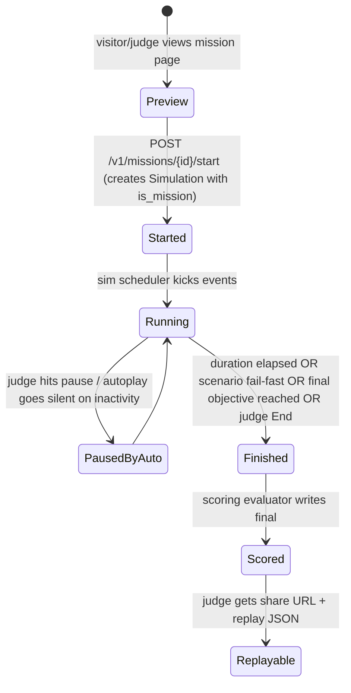

# 14 — Mission Mode (Interactive Cybersecurity Game)

Mission Mode turns CyberSim from a dashboard into a **playable cybersecurity simulation**: a judge/visitor is handed a*budget of time and information, watches events unfold, lets the AI analyst surface threats, and **decides responses** — ending with a scored outcome. This is the demo killer productized as a feature, available to judges (no signup) and to logged-in operators (training).

> **Normative principles (recap):** runs are a normal `Simulation` with `is_mission=true`; a `Mission` is a scenario + objectives + scoring config; the analyst and the executor are reused unchanged; public-share (judge) links are read-only with a thin "Execute" gate. **Nothing bypasses the validators** (`11`, executor still whitelists responses).

---

## 1. Mission anatomy

```yaml
# missions/finbank_breach.yaml  (id: mission.finbank_breach)
id: mission.finbank_breach
title: "Mission: Protect FinBank"
subtitle: "5 servers · 3 APIs · 1 database · 200 users"
simulator: web
scenario_id: web.app.sqli_login
duration_sec: 360                       # interactive run length
theater:
  title: "Protect FinBank"
  image: /missions/finbank.svg
  ambient_track: "none"                 # placeholder for v0.1; flag for audio off
objectives:
  - id: detect_injection
    title: "Detect SQL injection within 90s"
    auto_eval: true                     # automatically scored (rules)
    kind: detection_within
    params: { threat_class: sql_injection, severity: high, within_sec: 90 }
    points: 25
  - id: identify_chain
    title: "Identify the full attack chain to data exfiltration"
    auto_eval: true
    kind: detection_covers_stages
    params: { stages: [initial_access, credential_access, exfiltration] }
    points: 25
  - id: contain_in_time
    title: "Contain the attacker before data exfiltration completes"
    auto_eval: true
    kind: action_executed_before_event
    params: { action_id: block_source_ip|disable_endpoint|quarantine_host,
              stop_event_subtype: data_exfiltration,
              stop_within_sec_of_first_attack: 60 }
    points: 30
  - id: minimal_collateral
    title: "Avoid over-blocking benign users (>5% tore 401/rate-limited)"
    auto_eval: true
    kind: benign_collateral_below
    params: { max_pct: 5, within_sec: 120 }
    points: 10
  - id: analyst_trust
    title: "Use AI analyst evidence on every executed action"
    auto_eval: true
    kind: every_executed_action_backed_by_detection
    points: 10
sharing:
  public_default: true                  # generate share link with no signup
  allow_stretch_telemetry: true         # public-runs contribute to aggregate stats
autoplay: false                         # judge must click EXECUTE; auto-advances optional
scoring:
  speed_weight: 0.3
  correctness_weight: 0.5
  containment_weight: 0.2
  bonus_for_no_collateral: 5
  max_score: 100
```

### 1.1 Mission is a superset of a scenario
- A mission always references one (v0.1) `scenario_id`; v0.2 may compose multiple scenarios.
- Objectives are *auto-evaluated against events/detections/actions* (`13` does not require free-text judging — we treat the mission as deterministic and reproducible).

## 2. Lifecycle



## 3. The Theater UI (`components/mission/MissionStage.tsx`)

```
┌────────────────────────────────────────────────────────────────────────────┐
│  MISSION · Protect FinBank                              02:34 / 06:00      │
│  ━━━━━━━━━━━━━━━━━━━━━━━━━ progress bar (sim time)  ▣ healthy  ⛌ degraded   │
├──────────────────────┬────────────────────────────────┬──────────────────────┤
│ OBJECTIVES (left)    │ EVENT TICKER + AI ARREST(center)│ INSPECTOR + ACT (right)│
│  ☐ Detect SQLi       │ ⚠ 09:02:11 POST /api/login    │ EXECUTE RESPONSE      │
│  ☐ Identify chain    │ ⚠ 09:02:12 malformed params    │  ┌─────┐ ┌────────┐    │
│  ☐ Contain attacker  │ ⚠ 09:02:13 DB error           │  │Block│ │Rate-lim│    │
│  ☐ Minimal collateral│ ⚠ 09:02:14 pattern detected  │  │ IP  │ │ login  │    │
│  ☐ Trust AI evidence │ 🔴 09:02:16 large response    │  └──▆▆▆┘ └────────┘    │
│                      │                                │ [ big glowing EXECUTE ]│
│ 💡 AI analyst interim│ ┌─ ATTACK DETECTED ─┐          │                       │
│ "Credential breach…  │ │ credential_cmp · HIGH 91%   │ Telemetry + Audit      │
│  evidence at…"        │ │ evidence ▸ attack path ▸ ▸  │                       │
│                      │ └──────────────────────────┘  │ SCORE  67/100         │
└──────────────────────┴────────────────────────────────┴──────────────────────┘
```

### 3.1 Layout discrete choices (justified)
- **Objectives column**: progress + small badges when auto-eval flips to ✓ (animated check, ≤200ms). This keeps the player alert to the win-conditions.
- **Center radar**: event ticker (top half) + AI detection card (pinned when emitted). Persistent; no card stack — one pinned "current" detection, with a horizontal scroller for past detections.
- **Right inspector + EXECUTE**: the response console stays visible; the **EXECUTE RESPONSE** big glowing button is the focal affordance — it stays disabled until a detection is selected; on click it opens `ExecuteActionDialog` (action picker + impact summary including AI's recommendation + warnings; confirm requires second click for high-risk actions).
- Bottom status bar: sim time, elapsed, health, last-action audit, current score.

### 3.2 Driving decisions
> **Self-question:** Should the judge be able to *over-drive* the attack (e.g., add attacker intent) for stretchy engagement? **Answer:** v0.1 — no. Mission = judge acts as *defender*; adversary is scenario-driven. Attackers polluting theadle-from-judge is a v0.2 "red vs blue" feature; keeping v0.1 simple + reproducible. The brief explicitly frames the judge as defender.

## 4. Scoring engine (`cybersim.mission.scoring`)

Inputs collected as the sim runs (written to `mission_scores` live + final row):
- **Per-objective state**: tracked from canonical events + actions (rules below).
- **Speed**: time from sim-start to objective completion (and to detection, separately).
- **Correctness**: detections the user *confirmed* (used as basis for actions) match the seeded attack's `expected_detections` (`06` scenario).
- **Containment**: was the attacker stopped before `data_exfiltration` event with high severity?
- **Collateral damage**: counts of `auth.attempt.isSuccessful=false` from benign `correlation_key`.

```python
# cybersim/mission/scoring.py (excerpt)
def score_objective(obj: Objective, ctx: ScoringContext) -> ObjectiveResult:
    if obj.kind == "detection_within":
        det = ctx.first_detection(lambda d: d.threat_class == obj.params["threat_class"]
                                            and Severity.rank(d.severity) >= Severity.rank(obj.params["severity"]))
        ok = det is not None and (det.created_at - ctx.sim_started_at) <= timedelta(seconds=obj.params["within_sec"])
        return ObjectiveResult(objective_id=obj.id, achieved=ok, points=obj.points if ok else 0, evidence=det)
    # ... etc per kind
def finalize(mission, ctx) -> MissionScore:
    total = sum(r.points for r in objectives)
    score = round( mission.scoring_config.speed_weight      * speed_score(ctx)
                 + mission.scoring_config.correctness_weight * correctness_score(ctx)
                 + mission.scoring_config.containment_weight  * containment_score(ctx))
    if no_collateral(ctx): score += mission.scoring_config.bonus_for_no_collateral
    return MissionScore(score=min(score, mission.scoring_config.max_score),
                        components=..., objectives=..., replay=...)
```

## 5. Public/judge share flow (read-only)

- Mission definition can have `sharing.public_default=true`. On `start`, the API returns a `public_share_token` URL of form `/m/<token>` that opens the Mission Stage in **judge mode**:
  - No `org_id` (anonymous read), served by a special read-only pseudo-tenant `(public-mission)`.
  - The judge can **execute responses** (still whitelisted + validated — they mutate the simulation, gated by an in-memory rate limit to prevent spamming).
  - The judge **cannot** (a) see `/v1/me`, (b) start other missions without link, (c) make other API calls outside the mission's helper routes: `GET /v1/missions/{m}`, `POST /v1/missions/{m}/start`, `GET /v1/simulations/{sim}/*` (events, detections, graph, score), `POST /v1/simulations/{sim}/detections/{d}/execute`, `POST /v1/simulations/{sim}/detections/{d}/follow-up`. Strict CORS allow-list (`08` §11) for the public subdomain.
- Ephemeral: public simulations auto-expire after 24h; results retained for aggregate (no PII) "stretch telemetry."

### 5.1 Public pasa token security
- Token is `UUIDv7` with ~80 bits of randomness; **unlisted**; new token per `start` (the value is `simulation_id`-derived public_share_token); judge-friendly short URL via base58 hash.
- IP rate-limited; abuse flag → invalidate token.
- Server strips real user info from any "stretch telemetry" (count-on-increment only).

## 6. Objectives kinds (extensible enumeration)

| Kind | Evaluator | Auto-eval |
|------|-----------|-----------|
| `detection_within` | first detection matching threat_class & ≥severity, ≤ t | yes |
| `detection_covers_stages` | unique `attack_stage`s covered by all detections ⊇ required | yes |
| `action_executed_before_event` | action_id ∈ allowed, executed before stop_event_subtype appears | yes |
| `benign_collateral_below` | % < threshold | yes |
| `every_executed_action_backed_by_detection` | each executed_action links to a detection | yes |
| `no_false_positive_high_sev` | no detection of threat_class not in scenario.allowlist slots | yes |
| `manual_review` *(v0.2)* | judge input | no (v0.2 manual scoring panel) |

## 7. Autoplay/scrubbing
- `autoplay=false` default; if `true`, the sim clock advances automatically; user still gates *actions*.
- "Scrubber" mode (replay): finished mission replayable at 0.25×–4× speed with menu toggling event-graph-event-status; non-interactive — runs from the canonical event log + executed_actions audit. (Shareable link for "watch how it played out.")

## 8. Real-time integration with existing services

The Mission Stage consumes the **exact same WebSocket channels** as the SOC Dashboard (`08` §5), subscribing to `sim.{sim_id}` from start; objectives overlay is computed **client-side** by reading detections/actions/summary events the mission needs:
- Server-side `GET /v1/missions/{sim}/score` returns the authoritative score (live + final); the UI uses it for the score corner (debounced to ≤2 updates/sec to avoid flicker).
- Designed to allow us to power the **as-an-audience** experience without bespoke channels — Mission Mode is a *layout*, not a data-plane fork.

## 9. Shipped mission catalog (v0.1)

| Mission | Scenario | Why |
|---------|----------|-----|
| `finbank_breach` | `web.app.sqli_login` | Hero demo (mirrors product brief example) |
| `lateral_hunt` | `net.recon_lateral` | Network chain showcase |
| `poisoned_lib` | `supply.malicious_package` | Supply chain story + clean exec-response narrative |
| `api_credential_storm` | `api.brute_force` | Brute-force + rate-limit response interplay |

> 3 missions also pub-shared by default; inMission Library lists 4 with badges (`mission.recommended` for the first).

## 10. Self-questioning & decisions (missions)

| Decision | Chosen | Rejected | Why |
|----------|--------|----------|-----|
| Auto-evaluated objectives | Yes | manual judging | Reproducible demo; no judge bias; scales. Manual panel is v0.2. |
| Reuse the SOC dashboard data plane | Yes | separate mission services | Mission = layout/data; cheaper to maintain; same validation rules. |
| Public share = pseudo-tenant | Yes | sign-up wall | Demo virality (`01` §10 open question; closed: yes shareable). |
| Big-focus EXECUTE button | Yes | inline menu | Theatrical; matches "decider" interaction (`01` §4 journey B). |
| Defender-only role (judge) | Yes | red-vs-blue | Keeps v0.1 reproducible; red-vs-blue is a v0.2 mode. |
| Live score server-side authoritative, client mirror debounced | Yes | client-only | Server authoritative prevents client-side tampering public links. |
| Autoplay default off | Yes | autoplay on | Judge-driven = more dramatic; respects user pacing. |
| Stretch telemetry without PII | Yes | collect user-attributed | Privacy-preserving aggregate (mission completion rates etc.). |

---

End of `14-mission-mode.md`. Next: `15-security-multi-tenancy.md`.
