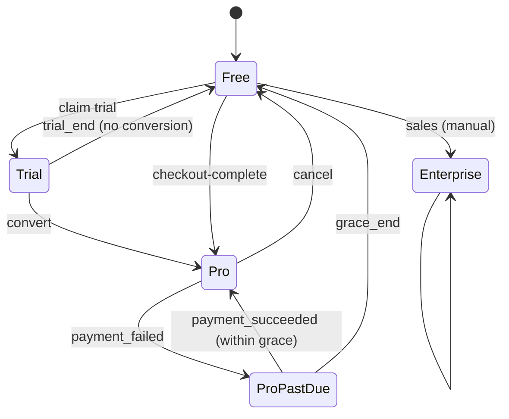

# 16 — Billing, Entitlements & Usage Metering

CyberSim AI SaaS monetization: tiered pricing, Stripe integration, entitlement rules, usage metering (sim minutes + LLM token/calls + mission starts + exports), and limits enforcement across platform layers. Documented as a *system* (not just a Stripe wiring guide) so the AI agent can implement accounting correctly across API → queue → worker → analyst.

> **Normative:** Stripe Checkout + Customer Portal + Webhooks + **metered billing** for usage-based lines; entitlements table is the synchronizing flap; the platform never trusts the client for quotas.

---

## 1. Tiers (v0.1 pricing — illustrative; final numbers are config, see `infra/billing/plans.yaml`)

| Plan | Price (USD/mo) | Concurrent sims | AI tier | Sim min / mo | Missions /mo | Retention | Public mission links | Knowledge | Tier support |
|------|----------------|-----------------|---------|--------------|--------------|-----------|-----------------------|----------|--------------|
| **Free** | $0 | 1 | `default` (gpt-4o-mini) | 60 | 3 | 7d | ✓ (3/day) | global only | community |
| **Pro** | $49 | 5 | `default+` (gpt-4o on risk/response) | 1,000 | 50 | 90d | ✓ (unlimited) | global | email |
| **Enterprise** | quote | per-contract | configurable | per-contract | per-contract | 365d+ | ✓ | global + private upload | Slack + named |

### 1.1 What's metered (and what's not)

| Metric | Metered? | Why |
|--------|----------|-----|
| `sim_minutes` | Yes (metered billing line) | Direct cost: workers + Redis stream holding |
| `llm_tokens_in` / `llm_tokens_out` (per model) | Yes | Direct cost; aggregated per period; metered line |
| `llm_calls` | Counted (no line charged; threshold quota) | Used for thresholds / DDoS-abuse protect |
| `exports` | Counted | Quota only |
| `missions_started` | Counted (Free limited; Pro/Ent essentially unlimited) | Quota only |

> **Self-question**Why meter LLM tokens by actual count instead of a flat per-sim credit? **Answer:** Simulations with `attacker_skill=expert` consume 3-5x more tokens (deeper reasoning + retrieval); flat pricing would penalize simpler sims and give backdoor over-use on heavy ones. Metered keeps it fair. Quotas (concurrency, retention) stay tier-based.

## 2. Stripe configuration

- **Stripe Customer:** created on first paid-plan checkout from the org admin.
- **Subscription:** Pro tier = recurring + metered usage line (`sim_minutes` + `llm_tokens`) with tiered overage model. Stripe-hosted Checkout Session for upgrade (`https://checkout.stripe.com/...`).
- **Customer Portal:** self-serve plan change, update card, cancel; Stripe redirects to `/billing/return`.
- **Webhook receiver:** `POST /v1/billing/webhook` (no auth header; verifies `Stripe-Signature` HMAC with the Stripe webhook secret). Events handled:
  - `checkout.session.completed` → set Pro entitlements + record sale audit.
  - `customer.subscription.updated` / `.deleted` → reconcile entitlements (downgrade/termination).
  - `invoice.payment_succeeded` → mark period start.
  - `invoice.payment_failed` → email + grace period (7 days) → downgrade.
- **Idempotency:** webhook event id stored; second delivery ignored (Stripe retries).
- **Test mode:** env `STRIPE_MODE=test` uses test keys; CI runs against Stripe CLI `stripe listen`. Prod secrets live in secret manager (`15` §5).

### 2.1 Metered usage reporting
- Per periodic flush (every 5 minutes; configurable), `cybersim.platform.billing.Ledger` calls `Stripe::UsageRecord.create` for the subscription item, summing `usage_events` since last watermark.
- We _throttle_ Stripe calls (one batch per org per period) to avoid rate limits; a ledger watermark persists in DB so we're crash-safe (`infra/billing/ledger_state`).
- Failures (rate limit, 5xx) retry with backoff; usage still increments locally and is reported on next flush.

## 3. Entitlement sync — the "decision surface"

- `entitlements` table (`09` §2.6) is the authoritative live snapshot used by API, workers, analyst.
- Entitlement updates are **eventual consistent:** Stripe webhook → `entitlements` row patched → cache invalidate (Redis) → next API worker reads new limits. **Never delays a request** (we read stale ≥ 30s after downgrade).
- Concurrency caps and usage-quota caps are enforced at three points:
  - **API gateway (`POST /v1/simulations`)**: rejects new sims over concurrency cap (counted from open sims with `status ∈ {running,paused}` for org).
  - **Simulation worker pool**: caps per-org concurrent workers via Celery's concurrency reservation + Redis tally in a Lua-atomic script; worker refuses to start if reached.
  - **LLM Router** (`11` §7): per-org token budget; on exceeding soft quota, lower model routing; on hard quota, queue LLM calls (or degrade to fallback).

### 3.1 Limits enforcement contracts

| Limit | Where enforced | Action on exceed |
|-------|----------------|------------------|
| `max_concurrent_sims` | API + worker | `POST /simulations` → `429 SIMULATION.CONCURRENCY_LIMIT` |
| `sim_minutes_month` | API start + final tally | over-quota: rejects start with 429; metered billing for overage on metered plans |
| `llm_tokens_period` | Router (analyst) | soft: route to cheaper model; hard: degrade to rule_fallback |
| `missions_started_month` | mission starter | 429 MISSION.QUOTA |
| `exports_month` | export endpoint | 429 EXPORT.QUOTA |
| `retention_days` | prune job | prune job ignores above floor |

## 4. Free-to-paid path & trial

- **No card at signup.** Free tier usable immediately.
- 14-day **Pro trial** offered in-app (banner on dashboard degraded states); trial flagged in `entitlements` with `trial_until`; webhook end-of-trial restores Free unless converted.
- Upgrade: Stripe Checkout returns to `/billing/return`; resolve session → set Pro entitlements.

## 5. Subscription lifecycle handling

- `entitlements.plan` + `entitlements.entitlements` JSONB reflect each state; audit log rows per transition.

## 6. UI surfaces

- **Sidebar usage meter** (`AppShell` bottom): ring or bar showing current-period `sim_minutes` vs cap and `llm_tokens` vs cap, plus "Pro plan · 12 days left in period."
- `/billing/plan`: current plan, usage bar, upgrade CTAs, customer-portal link.
- `/billing/invoices`: list recent invoices (mirrored from Stripe via `GET /v1/billing/invoices` thin proxy).
- Mission library shows mission-usage chip ("3 of 50 missions this month").

## 7. Quality gates

- **Idempotent ledger flush**: write a known-overage to a throwaway test org; assert Stripe webhook receipt + reconciled `entitlements` row.
- **Concurrent cap enforcement** integration test: enqueue `max+1` sims for an org; assert the last one is rejected.
- **Webhook retry** test: deliver event twice → row affects state once.
- **Stripe tests** run against stripe-mock in CI; no real test-mode calls except scheduled nightly.

## 8. Self-questioning & decisions (billing)

| Decision | Chosen | Rejected | Why |
|----------|--------|----------|-----|
| Stripe (vs ChargeBee/Paddle) | Yes | others | Mature metered billing + Portal + webhook breadth (`04` §2.17) |
| Metered sim_minutes + llm_tokens | Yes | flat per-sim credits | fairness + scalability of cost (`16` §1.1) |
| No card at signup | Yes | card-required trial | reduces friction (SOC tools churn) |
| Webhook-idempotency mandatory | Yes | best-effort | Stripe retries; must be safe |
| Entitlements eventual-consistent (≤30s) | Yes | blocking | user experience > micro-perfect |
| Concurrency enforced at API + worker | Yes | at API only | protects against race on worker pool |
| LLM soft/hard token quota | Yes | hard-only | graceful degradation (`11` §7) |
| Free plan includes public missions | Yes | paid-only | Demo virality > monetization in the SOC community |
| Manual enterprise quoting | Yes | self-serve ent | procurement reality at >200-seat |

---

End of `16-billing-saas.md`. Next: `17-deployment-infra.md`.
