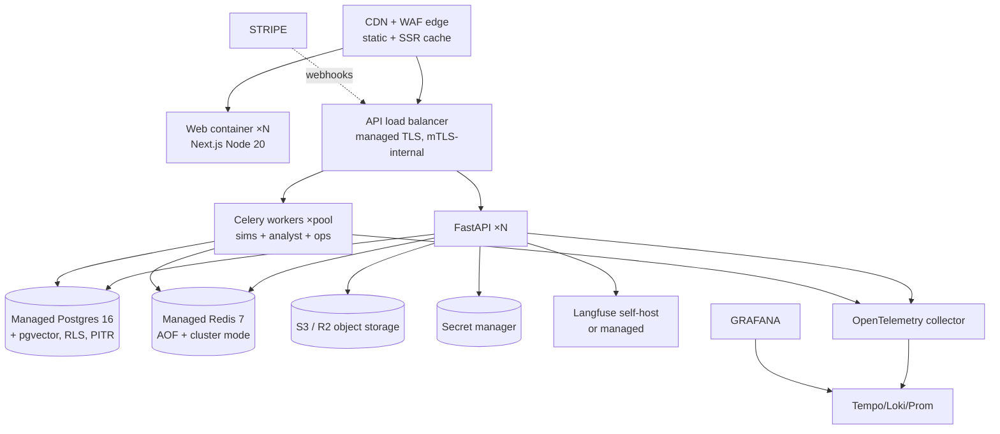

# 17 — Deployment & Infrastructure

Container layout, local dev via Docker Compose, environment topology, IaC strategy (Terraform), CI/CD pipeline, scaling, multi-environment promotion, and rollback. Goal: an implementing agent can stand up local dev in <5 minutes and prod in a documented sequence.

> **Normative:** `uv` (Python) + `pnpm` (JS) + Docker + Docker Compose + Terraform. Primary cloud is cloud-agnostic via Terraform (default warehouse: AWS or GCP, chosen in deployment step; v0.1 ships dev + one prod topology).

---

## 1. Local dev (Docker Compose)

`docker-compose.yml` brings up:
- `postgres` (pgvector baked via init script; predefined db/user)
- `redis` (with AOF on for streams persistence)
- `minio` (S3-compatible, with a `cybersim-bucket` auto-created)
- `web` (Next.js, dev server on `:3000`)
- `api` (FastAPI uvicorn `:8000`, hot reload via `--reload` reading `cybersim/`)
- `worker` (Celery worker; also runs `beat` for nightliner schedules)
- `normalizer` consumer
- `langfuse` (self-hosted, optional `--profile llm-obs`)
- `grafana` + `loki` + `tempo` + `prometheus` (optional `--profile obs`)

Commands:
```bash
docker compose up -d postgres redis minio
docker compose up web api worker normalizer
docker compose --profile obs up -d
docker compose exec api cybersim db upgrade      # Alembic head
docker compose exec api cybersim knowledge refresh
docker compose exec api cybersim seed --demo     # admin user + default org
```
Single-command bring-up for the implementing agent is part of `21`.

## 2. Service containers

| Image | Base | Notes |
|-------|------|-------|
| `cybersim-api` | `python:3.11-slim` distroless-style | `uv sync --frozen`; entrypoint `cybersim api serve` |
| `cybersim-worker` | same as api | `celery -A cybersim.platform.queues worker -Q sims,analyst,ops --concurrency=2` |
| `cybersim-normalizer` | same | `cybersim events normalizer --group normalizer` |
| `cybersim-web` | `node:20-alpine` multi-stage build | `pnpm build && pnpm start`; non-root user |

All built via multi-arch `linux/amd64,linux/arm64`; thin layers + cache-mounted `uv`/`pnpm` store.

## 3. Environments

| Env | Purpose | Data | Secrets | Uptime target |
|-----|---------|------|---------|---------------|
| `local` | dev machine | compose volumes | env.dev (gitignored) | — |
| `ci` | ephemeral | disposable PG/Redis containers | ephemeral, masked | — |
| `staging` | pre-prod mirror | full subset (seeded) via terrform prod ops | secret manager test | mirrored SLAs |
| `prod` | customer-facing | managed PG/Redis (multi-AZ) + S3/R2 | secret manager prod | SLO (`18`) |

### 3.1 Promotion path
- `main` → CI builds → **staging auto-deploy** → **smoke suite** (`20`) → manual approval → **prod deploy**.
- Hotfix: cherry-pick to release branch → same gate but `priority` queue.
- Trunk-based; short-lived feature branches; main requires green CI + 1 reviewer; **tenant-change** tag requires 2 reviewers (`09` §11).

## 4. Production topology (cloud-agnostic)


- **Stateless** API + workers behind LB; **stateful**—managed PG/Redis/object store.
- Scaling: API HPA on CPU + simultaneous WS connections; workers on Redis stream depth (`bus.lag` metric, see `18`). Worker pool scaled by sim depth + queued depth.
- Multi-AZ; prod DB has PITR + daily full backups + cross-region replicas (read-only async replica for analytics & codemining knowledge refreshes).

### 4.1 IaC layout (`infra/terraform`)
```
infra/terraform/
├─ modules/
│  ├─ network      (vpc/subnets/sgroups)
│  ├─ postgres     (managed instance + RLS init scripts)
│  ├─ redis         (managed)
│  ├─ object_store (S3/R2)
│  ├─ secrets      (KMS-backed secret manager)
│  ├─ api_service  (ECS/CloudRun/container_service depending on cloud)
│  ├─ worker_service
│  ├─ web_service
│  ├─ observability (OTel collector + dashboards-as-code)
│  └─ dns_cdn      (DNS + WAF + CDN)
└─ environments/
   ├─ staging/
   └─ prod/
```
- All variables version-pinned; `terraform plan` runs in CI per PR (`20`). State in remote backend (S3 + DynamoDB lock or equivalent) outside the env module.

## 5. CI/CD pipeline (GitHub Actions)

```mermaid
graph LR
  PR[PR opened/updated] --> PRE[pre-commit lint]
  PRE --> UNIT(unit tests)
  UNIT --> INTG[Compose-up integration]
  INTG --> CONTRACT[OpenAPI contract diff]
  CONTRACT --> SECURITY[security scans: gitleaks, pip-audit, npm audit]
  SECURITY --> BENCH[determinism + replay tests]
  BENCH --> LIGHTHOUSE[Lighthouse perf gate]
  LIGHTHOUSE --> COV[coverage gate]
  COV --> BUILD[build + scan images]
  BUILD --> PUSH[push to registry]
  PUSH --> DEPLOY_STAGE[deploy staging]
  DEPLOY_STAGE --> SMOKE[staging smoke suite]
  SMOKE --> APPROVAL{approval}
  APPROVAL --> DEPLOY_PROD[deploy prod]
  DEPLOY_PROD --> SMOKE_PROD[prod smoke + canary]
```



### 5.1 Quality gates (cross-ref `20`)
- pre-commit: ruff (lint + fmt), mypy --strict, eslint, prettier, tsc --noEmit, gitleaks, no raw hex in components.
- Test: unit > 70% coverage gate on changed packages; integration compose-up; contract diff no breaking change; replay determinism; Lighthouse ≥ 90 (marketing) / ≥ 85 (dashboard).
- Image build + scan: trivy; COSIGN signed images.

## 6. Configuration & secrets (per-env)

- **App config** in typed environment loaded via Pydantic `BaseSettings` (`cybersim.infra.config.Settings`):
  ```python
  class Settings(BaseSettings):
    env: Literal["local","ci","staging","prod"]
    llm_provider: str = "openai"
    llm_model_triage: str = "gpt-4o-mini"
    llm_model_analysis: str = "gpt-4o"
    anthropic_api_key: SecretStr | None = None
    openai_api_key: SecretStr | None = None
    graph_backend: Literal["nx","neo4j"] = "nx"
    knowledge_embed_model: str = "text-embedding-3-small"
    billing_stripe_mode: Literal["test","live"] = "test"
    realtime_fanout_mode: Literal["redis","sticky"] = "redis"
```
- **Secrets** resolved at boot from secret manager (`15` §5); local uses `.env` files gitignored.
- **Feature flags**: lightweight in-app flags via `entitlements` row or `cybersim.feature_flags` (Redis-cached); used for `mission_public_share`, `neo4j_backend`, etc.

## 7. Horizontal/vertical profile baselines

| Service | Request-path | Profile |
|---------|--------------|---------|
| API REST read | 100 ms p95 (cache hit) | no scaling limit on read; LB nat-limited |
| API WS fan-out | sustained 1 msg/sec per conn; ≤3,000 conn/inst | HPA on conn count |
| API mutation (LLM-mediated) | seconds; honest backpressure | -|
| API WS sub/unsub | ≤ 100/sec/conn | -|
| Worker sim | 1 vCPU/2 GiB per concurrent sim | pool autoscale on queue depth (`03` §7) |
| Normalizer | 0.25 vCPU/0.5 GiB per stream | HPA on consumer lag |

## 8. Disaster recovery & backups
- **Postgres recovery:** PITR (≤ 5-min RPO via continuous WAL archiving) + daily snapshot; restore drill quarterly (v0.2 milestone).
- **Object store:** versioning + cross-region replication (for prod tier).
- **Redis:** AOF; considered ephemeral data: events stream is replayable from `events` table; stream retention ≥24h covers window needs.
- **Knowledge ingestion:** idempotent re-run; refresh safe (`12` §3.1).
- **RTO target:** ≤ 30 min for prod DNS+initial shell; ≤ 4 h for full recovery.

## 9. Multi-region / data residency (v0.2)
- v0.1 single-region prod; v0.2 `cybersim.region` option controls deployment to `us` (default) or `eu`. EU region reserved in `infra/terraform/environments/` via `var.region` (no logic in code beyond a metadata stamp).

## 10. Self-questioning & decisions (deploy)

| Decision | Chosen | Rejected | Why |
|----------|--------|----------|-----|
| Single cloud + Terraform modules | Yes | per-cloud native IaC | Buys cross-cloud optionality; team familiarity (`04` §2.18) |
| Managed PG/Redis in prod | Yes | self-host | Ops cost; managed HA + PITR; reduces SRE surface |
| Stateless API + Redis fan-out multi-instance WS | Yes | sticky WS | Clean deploys + scale (`03` §8.2) |
| Trunk-based + short feature branches | Yes | gitflow | small + frequent deployments; safer progress |
| Manual prod gate after staging smoke | Yes | full auto | Change-risk budget; rollback-friendly |
| Image signing (cosign) + scan (trivy) | Yes | push-only | Supply-chain confidence (we're a security product) |
| Worker pool share sim + analyst queues | Yes | separate pools at MVP | Same image config; simpler; HPA can split later if profiles diverge |

---

End of `17-deployment-infra.md`. Next: `18-observability.md`.
