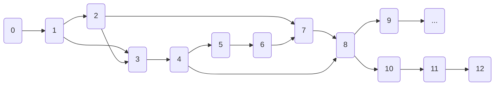

# 19 — Development Roadmap

A phased build plan orchestration of CyberSim AI from empty repo to a deployed, evidence-grounded, demoable SaaS. Each phase has: **goal**, **files touched** (cross-ref paths), **definition of done (DoD)**, **dependencies**, and **verification commands** (see `20`). The order is strictly required — later phases depend on contracts from earlier ones. This document is what an AI agent's orchestrator follows (`21`).

> **Bootstrap conveniences:** every phase starts by reading the **relevant docs** and ends by running the **phase's verification command(s)**. Do not advance a phase until the previous one's DoD is green. The repo is a Python workspace (`uv`) + JS workspace (`pnpm`) under one root with two top-level dirs: `cybersim/` (Python) and `apps/web/` (Next.js).

---

## Phase 0 — Repository bootstrap & tooling

**Goal:** runnable monorepo skeleton with all tooling wired so subsequent phases inherit a green baseline.

**Touched:**
- `pyproject.toml`, `uv.lock`, `ruff.toml`, `mypy.ini`
- `apps/web/package.json`, `apps/web/tsconfig.json`, `apps/web/tailwind.config.ts`, `apps/web/.eslintrc.cjs`, `apps/web/.prettierrc`
- `.pre-commit-config.yaml`, `.gitignore`, `Makefile` (or `tasks.py` via `taskipy`)
- `docker-compose.yml` (services up but no business logic)
- `infra/docker/Dockerfile.{api,worker,web}`
- `README.md` with quickstart
- `.github/workflows/ci.yml` (lint + type + test placeholders)

**DoD:**
- `docker compose up -d postgres redis minio` works
- `uv sync` and `pnpm install` succeed
- `pre-commit run --all-files` green
- `make` / `taskipy` shortcut `make test` runs zero-failing pytest
- CI runs on PR

**Verification:** `make verify` (lint + types + tests + compose-up smoke).

---

## Phase 1 — Domain core & events contract

**Goal:** the **contract surface** every later module sits on: `CanonicalEvent` and `RawEvent` Pydantic models, MITRE mapping table, the simulator base interface, the `EventBus` interface + Redis Streams impl, and the simulator-environment-graph type definitions (`05`) — without yet implementing any actual simulator or analyst.

**Touched:**
- `cybersim/events/schema.py`, `payloads/*.py`, `mapping.py`, `types.py`
- `cybersim/graph/types.py`, `mitre.py` (mapping)
- `cybersim/simulation/base.py`, `core/rng.py`, `core/clock.py`, `core/context.py`
- `cybersim/events/bus.py` (interface) + `events/bus_redis.py` (impl)
- `cybersim/infra/config.py` (typed settings)
- Tests for the above (schema reject nonexistent fields, payload parsers, event-bus idempotency).

**DoD:**
- Schema models enforce `extra="forbid"`; payload parsers reject malformed.
- MITRE mapping returns exact rows for every `ThreatClass`.
- `EventBus` round-trip with Redis Streams; dedup-by-id returns one canonical row.

**Verification:** `pytest cybersim/events cybersim/simulation/core cybersim/graph -v`.

---

## Phase 2 — Scenario catalog + first simulator (Web)

**Goal:** scenario YAML loader, the catalog inventory (`06` §7), `EnvironmentGraph` building from YAML, and the **Web simulator** end-to-end producing raw events (deterministic).

**Touched:**
- `cybersim/simulation/catalog/loader.py`, `catalog/*.yaml`, `catalog/web.finbank.env.yaml`
- `cybersim/simulation/web/simulator.py`, `beats.py`, `commands.py`
- `cybersim/simulation/scoring/*` (nullable stubs)
- Worker entrypoint: `cybersim/simulation/tasks.py` (Celery task)

**DoD:**
- `cybersim.simulation.run_web_sqli(seed=N)` produces identical event sequences for two runs with same seed (determinism test passes).
- Raw events match payload schemas for `http.request`, `db.error`, `auth.success`, etc.
- `apply_command("block_source_ip")` removes the relevant edge in the env graph and emits `response.applied` + 403s for further attacker attempts.

**Verification:** `pytest cybersim/simulation/web cybersim/simulation/catalog -v`; determinism test in `tests/sim_determinism/`.

---

## Phase 3 — Attack graph engine + Postgres schema

**Goal:** durable `events`/`simulations`/`detections`/graph tables + the `GraphRepository` interface and its **NetworkX** impl, with snapshot/delta and the in-process cache.

**Touched:**
- `cybersom/infra/db/` — Alembic env, migration 0001 (`infra/db/migrations/`)
- `cybersim/graph/repo.py`, `repo_nx.py`, `cache.py`, `delta_store.py`, `dal.py` (Postgres DAL)
- `cybersim/events/normalizer.py` (consumer) + `events/normalizer_tasks.py` (Celery entrypoint)
- Postgres enums + RLS baseline (manual migration 0002, reviewed)
- `cybersim/platform/` minimal: `users`, `orgs`, `sessions` tables

**DoD:**
- A web-sim run flows raw → normalizer → canonical events persisted in Postgres with partitioning enforced; graph is built and persistence lives in `graph_nodes/edges`; snapshot+delta written.
- RLS fail-closed test passes (`20`): unset `app.current_org_id` returns zero rows.
- `repo.attack_paths` returns expected result for the FinBank chain for the test scenario.

**Verification:** `docker compose up -d postgres redis` once; `cybersim db upgrade`; `pytest cybersim/graph cybersim/events -v`.

---

## Phase 4 — API gateway + REST + WS realtime

**Goal:** FastAPI gateway with auth, RBAC, tenant resolution, `/v1/...` REST routes covering scenarios/simulations/events/detections/graph/missions/knowledge/billing; WebSocket hub with Redis pub/sub.

**Touched:**
- `cybersim/api/` routers (`auth`, `orgs`, `scenarios`, `simulations`, `events`, `detections`, `graph`, `missions`, `knowledge`, `billing`)
- `cybersim/realtime/hub.py`, `realtime/ticket.py`, `realtime/pubsub_redis.py`
- `cybersim/platform/auth/` (JWT, refresh, webauthn opt start)
- `infra/errors/codes.py`, RFC 9457 problem handler, idempotency middleware, rate-limit middleware

**DoD:**
- `POST /v1/simulations` causes a worker to start; `GET /ws` deliveries `event.upsert` frames in order; `POST .../execute` (once `response_actions` exists — stub actions pre-analyst) mutates graph and emits a `graph.delta` frame.
- Idempotency works (same key returns same `simulation_id`).
-WS client sees coalesced batches at burst; lag frame emitted under load.

**Verification:** API smoke suite in Postman/newman mirror contract; `pytest cybersim/api cybersim/realtime -v`; **OpenAPI snapshot diff vs committed** (`apps/web/src/lib/api/schema-schema.lock.json`).

> Note: Detections endpoint should still work with the rule-based fallback **before** AI is implemented; rule-based detector has direct seeded severities (`11` §3.11). This is a safety test that detection can be emitted without an LLM.

---

## Phase 5 — Rule-based fallback detector + skeleton AI

**Goal:** the validator `validation_gate` and a **rule-based fallback** emitting valid `DetectionProposal`s from canonical events + graph distance — so we have a *working* detection pipeline before LLM. Wire `reason_fallback` to the API.

**Touched:**
- `cybersim/analyst/runtime.py` (LangGraph skeleton), `state.py`, `dto.py`, `tools.py`
- `cybersim/analyst/rules_fallback.py`, `validator.py`
- `detections` + `detection_evidence` + `recommended_actions` write paths in `cybersim/api/routers/detections.py`

**DoD:**
- Running web-sqli sim with AI tier disabled (via feature flag) produces a `credential_compromise` Detection with ≥3 evidence items and a full attack_path; `[source="rules"]` and degraded banner path emits.
- Validator clamps severity by graph distance.
- run book smoke: activate fallback explicitly, get reliable detect.

**Verification:** `pytest cybersim/analyst -v`; mission `finbank_breach` succeeds with `analyst.mode=rules`.

---

## Phase 6 — LLM analyst (LangGraph nodes + RAG)

**Goal:** rest of the analyst nodes (`threat_detection`, `graph_retrieval`, `evidence_analysis`, `rag_lookup`, `risk_scoring`, `response_planning`) and the actual LLM calls behind `LLMClient`. Knowledge ingestion (`MITRE/OWASP/CVE`) into pgvector and `KnowledgeRepository`.

**Touched:**
- `cybersim/analyst/nodes/*.py` per `11` §3, `prompts/*.j2`
- `cybersim/analyst/llm/llm_client.py`, `router.py`
- `cybersim/knowledge/` adapters, ingest, embeddings, retrieval, rerank
- `cybersim/tools/seed_knowledge.py`

**DoD:**
- Same scenario with AI on returns `confidence ≥ 0.85`, sourced AI, RAG citations include MITRE T1110/T1078.
- `ops_llm_invocations` plus Langfuse capture inputs; validator clamps confidence downward when evidence count low.
- Hallucinated MITRE technique dropped (test seed).
- Recalls ≥95% on scenario-replay goldens (preliminary gate for `01` §7).

**Verification:** `pytest cybersim/analyst/test_nodes cybersim/knowledge -v`; replay suite `tests/replay_golden/`.

---

## Phase 7 — Other three simulators (API, Network, Supply Chain)

**Goal:** ship the remaining simulators so the full scenario catalog MVP is realized; verify their env templates, beats, command vocabularies.

**Touched:**
- `cybersim/simulation/{api,network,supply}/*`
- catalog YAML additions
- response_actions entries per simulator (`04`/`06`)

**DoD:**
- Each simulator has its own determinism test.
- ALL `.06` scenarios detection-recall ≥95% via scenario-replay tests.
- The 7 simulator archetypes visible in the UI selector (3 as `status=roadmap`).

**Verification:** `pytest tests/sim_determinism tests/scenario_golden -v`.

---

## Phase 8 — Frontend foundation & SOC dashboard

**Goal:** the Next.js app: design tokens, primitives, AppShell, Sidebar, route gates, typed API client, WS provider; the SOC dashboard (`simulations/[id]`) shows events/detections/graph/inspector/response console.

**Touched:**
- `apps/web/src/styles/*`, `tailwind.config.ts`, `components/ui/*`, `components/shell/*`
- `lib/api/*`, `lib/ws/*`, `lib/auth/*`
- `app/(dashboard)/*` routes + `components/dashboard/*` per `13` §6
- `middleware.ts`

**DoD:**
- Lighthouse ≥ 85 on the dashboard route in CI.
- Keyboard nav (`J/K`) works; theme/density toggle persists.
- Evidence-glow interaction (selection cascades) visible.
- DetectionCard displays evidence + path + citations + recommended actions.
- WS reconnect resumes from cursor.

**Verification:** `pnpm test`, `pnpm build`, `pnpm lighthouse:local` in CI.

---

## Phase 9 — Mission Mode + public sharing

**Goal:** mission theater UI + scoring engine + public share links; ship 4 missions per `14`.

**Touched:**
- `apps/web/src/components/mission/*`, `app/(dashboard)/missions/*`
- `cybersim/missions/*` (DSL, scoring, share tokens)
- Pseudo-tenant public routes + CORS allow-list

**DoD:**
- Mission `finbank_breach` offers shareable link with no signup; judge executes responses; final score appears.
- Objectives auto-eval; audit trail under pseudo-tenant.

**Verification:** `pytest cybersim/missions -v`; e2e mission run in CI with screen flow.

---

## Phase 10 — Billing + entitlements + 3rd-tier simulators polish

**Goal:** Stripe Checkout/Portal/webhooks; metered usage; entitlements propagate; map all limits in API/worker/router (`16`).

**DoD:** subscription transitions active-flow integration test; `entitlements` reflects via webhook; ROI on usage limits in worker; UI surfaces them.

---

## Phase 11 — Observability, IaC, deploy to staging

**Goal:** OTel + Langfuse + Grafana dashboards; Terraform modules for staging; CI pipeline dumps to staging after smoke; SLOs reportable.

**DoD:** staged deployment passes smoke; demoable end-to-end on staging; runbooks revisable by on-calls.

---

## Phase 12 — Marketing site + accounts/billing pages + hardening

**Goal:** public marketing pages (`(marketing)`) showcasing the architecture diagram as a live artifact; account pages; final a11y pass; perf.

**DoD:** public site reachable; testimonials-ready homepage; final Lighthouse ≥90 on marketing.

---

### Phase ordering dependencies graph

High-level: contracts (1) → one sim + graph + DB (2–3) → API + realtime (4) → rule-fallback (5) → AI + RAG (6) → other sims (7) in parallel with frontend (8) → missions (9) → billing (10) → ops (11) → polish (12). Use Phase 7 as a "fill-up parallelism" lane alongside 5/6 if you have multiple agents.

## Milestones summary table

| M# | When | Happens |
|----|------|---------|
| M1 | End of Phase 5 | "Rule-based" demo (no LLM needed) — minimal but evidence-grounded. |
| M2 | End of Phase 6 | AI live + RAG; demo-able in CLI via raw API. |
| M3 | End of Phase 9 | Mission Mode end-to-end — **the pitch demo**. |
| M4 | End of Phase 12 | Production-ready prod deploy; SLOs; Lighthouse ≥90. |

---

End of `19-development-roadmap.md`. Next: `20-testing-strategy.md`.
